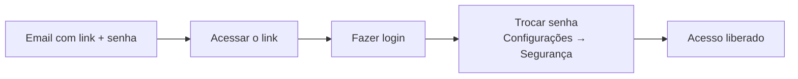
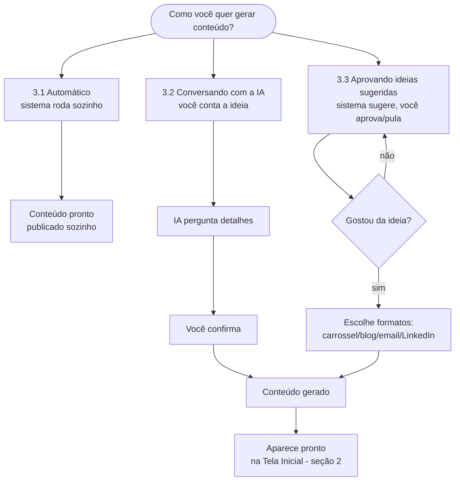
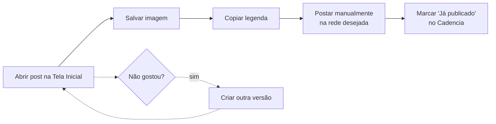
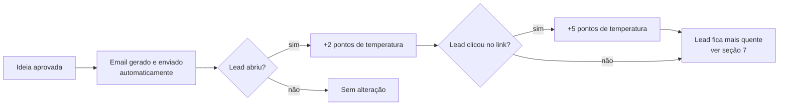
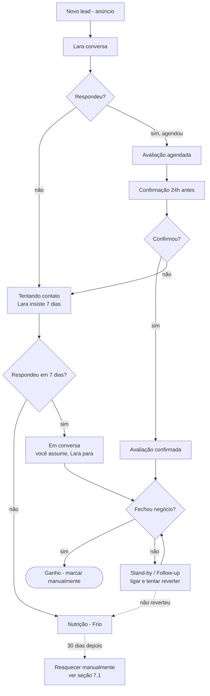
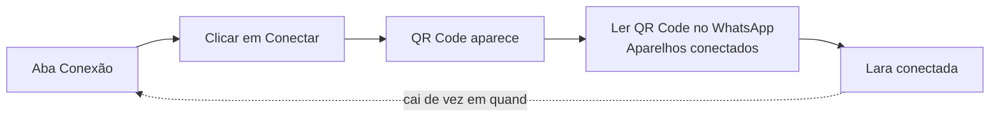

> **Diferente dos demais docs desta pasta:** este é o Manual do Sistema **voltado ao cliente final** (linguagem acessível, sem jargão técnico) — os outros docs em `Projetos/Cadencia/Docs/` são técnicos, pra equipe. Fonte de conteúdo validada contra o código real dos repos `cadencia-app` e `cadencia-lara` (levantamento Catarina, 07/07/2026) + passo a passo real demonstrado em reunião (transcrição OP Odontopenha, 07/07/2026).
>
> **Template mestre** vive em `pd-framework/times/cs/foundation/templates-documentos/manual-do-sistema-cadencia.md` — esta nota é a versão publicável (via `/compartilhar-nota`) por cliente, parametrizada.
> **Status:** DRAFT — Felipe revisa antes do primeiro envio real a um cliente.
> **Critério:** quem lê consegue **operar sozinho**, sem precisar perguntar nada — cada seção segue O que é → Para que serve → Passo a passo → O que fazer se algo der errado.
> **1º uso:** OP Odontopenha ([[CSE-153]], projeto Automação do Onboarding CS).

# Manual do Sistema Cadencia

## Como usar este manual

Este documento está organizado por área do sistema. Você não precisa ler tudo de uma vez — use como referência: quando for fazer algo pela primeira vez, procure a seção correspondente e siga o passo a passo.

**Índice:**
1. [Primeiro acesso](#1-primeiro-acesso)
2. [Tela inicial (dashboard de conteúdo)](#2-tela-inicial-dashboard-de-conteúdo)
   - 2.1 Calendário de conteúdo
   - 2.2 Histórico e Desempenho
3. [Criar conteúdo — as 3 formas](#3-criar-conteúdo--as-3-formas)
   - 3.4 Área Visual — fotos e rosto da marca
4. [Publicar um post depois que ele foi gerado](#4-publicar-um-post-depois-que-ele-foi-gerado)
5. [Emails e Newsletter](#5-emails-e-newsletter)
6. [Contatos (CRM)](#6-contatos-crm)
   - 6.1 Empresas
7. [Oportunidades (Funil de vendas)](#7-oportunidades-funil-de-vendas)
   - 7.1 Reaquecimento de leads (Nutrição)
8. [Metas e Touchpoints](#8-metas-e-touchpoints)
9. [Lara — a assistente de IA no WhatsApp](#9-lara--a-assistente-de-ia-no-whatsapp)
   - 9.1 Conversas · 9.2 Conexão · 9.3 Playground · 9.4 Personalidade · 9.5 Conhecimento · 9.6 Comandos · 9.7 Limitações
10. [Créditos — como funciona a cobrança](#10-créditos--como-funciona-a-cobrança)
11. [Perguntas frequentes / o que fazer quando algo não funciona](#11-perguntas-frequentes--o-que-fazer-quando-algo-não-funciona)
12. [Abertura de chamado (suporte)](#12-abertura-de-chamado-suporte)

---

## 1. Primeiro acesso

**O que é:** o login individual que {{cliente}} recebe pra entrar no Cadencia.

**Para que serve:** cada pessoa da sua equipe que vai usar o sistema tem o próprio acesso — vocês não usam o mesmo login.

**Passo a passo:**
1. Você recebe um email com o link de acesso e a senha inicial
2. Acesse o link e faça login
3. Na primeira vez, é recomendado trocar a senha (Configurações → Segurança)
4. Se mais de uma pessoa da equipe vai usar o sistema, cada uma recebe seu próprio login — avise a gente quem precisa de acesso

**Se der errado:** não conseguiu entrar? Fale no grupo do WhatsApp que a gente reenvia o acesso.

---

## 2. Tela inicial (dashboard de conteúdo)

**O que é:** a primeira tela que aparece toda vez que você abre o Cadencia.

**Para que serve:** visão rápida do que já foi gerado e do que está esperando sua aprovação.

**Passo a passo:**
1. Ao entrar, você já vê os posts de carrossel prontos (Instagram), como um mural de cards
2. Ao lado, os posts de LinkedIn e os artigos de blog, cada um na própria aba
3. Clique em qualquer post pra abrir e ver o conteúdo completo (imagem + legenda)

**O que você NÃO precisa fazer:** não precisa gerar nada manualmente pra essa tela ter conteúdo — o sistema já roda sozinho no fundo, todos os dias.

### 2.1 Calendário de conteúdo

**O que é:** uma visão de calendário (mês/semana) com tudo que foi programado.

**Para que serve:** ver de uma vez só o que vai sair em cada dia, em cada canal (blog, email, newsletter, redes).

**Passo a passo:**
1. Vá na aba "Calendário"
2. Clique em qualquer dia pra ver o que está programado ali
3. Clique num item do calendário pra abrir o conteúdo completo

### 2.2 Histórico e Desempenho

**O que é:** registro do que já foi gerado/publicado, e as métricas de engajamento do Instagram.

**Para que serve:** acompanhar o que já saiu no ar e como está performando.

**Passo a passo:**
1. Vá na aba "Histórico" pra ver tudo que já foi gerado e publicado, com data
2. Vá na aba "Desempenho" pra ver as métricas de engajamento do seu Instagram (curtidas, alcance, etc.)

---

## 3. Criar conteúdo — as 3 formas

**O que é:** o motor de geração de conteúdo do Cadencia (posts, artigos, emails).

**Para que serve:** manter suas redes e seu blog sempre atualizados sem você precisar sentar e escrever.

Existem 3 jeitos de gerar conteúdo. Você pode misturar os três.

### 3.1 Deixar 100% automático (recomendado depois que você já confia no sistema)

**Passo a passo:**
1. Vá em Configurações → Redes Sociais
2. Conecte as contas que você quer que recebam posts automáticos (Instagram, LinkedIn)
3. Ative a chave "publicação automática"
4. Pronto — o sistema vai gerar e publicar sozinho, sem você aprovar nada

> ⚠️ **Recomendação:** não ative isso logo de início. Acompanhe manualmente as primeiras semanas pra ver os resultados antes de deixar 100% automático.

### 3.2 Conversar com a IA sobre uma ideia sua

**Passo a passo:**
1. Abra a aba "Criar conteúdo" (ou o chat, dependendo de onde você está no sistema)
2. Digite sua ideia em texto livre — exemplo: *"quero um post sobre o feriado, falando que teremos uma promoção"*
3. A IA vai te perguntar detalhes — por exemplo, que ângulo você quer: mais crítico, mais inspirador, mais focado em dados
4. Responda às perguntas dela
5. Quando ela perguntar "posso criar o post?", responda "pode"
6. O post é gerado — você vai encontrar ele na tela inicial (seção 2) pronto pra revisar

### 3.3 Aprovar ideias que o sistema já sugeriu

**Passo a passo:**
1. Vá na aba de ideias
2. O sistema mostra uma ideia de cada vez
3. Se não gostar, clique em "pular" — ele descarta e mostra a próxima
4. Se gostar, clique em "aprovar"
5. Escolha os formatos que você quer gerar a partir dessa ideia: carrossel, blog, email, LinkedIn (pode marcar mais de um)
6. Confirme — o sistema mostra uma estrelinha indicando que está gerando
7. Aguarde alguns minutos — o conteúdo aparece pronto na tela inicial

**Dica:** quando as ideias da fila acabam, o sistema gera automaticamente um novo lote. Você não precisa pedir mais ideias.

### 3.4 Área Visual — fotos e rosto da marca

**O que é:** o banco de imagens que o Cadencia usa pra montar as capas dos posts com um rosto humano.

**Para que serve:** deixar os posts com a cara do seu negócio — um dentista, vendedor ou outro rosto da equipe, em vez de imagem genérica.

**Passo a passo:**
1. Vá na área "Visual" (dentro de Configurações ou do perfil da conta)
2. Clique em "Minhas fotos"
3. Suba fotos da pessoa que vai aparecer nas capas (o dentista, o vendedor, quem vocês escolherem)
4. A partir daí, os posts gerados vão usar esse rosto automaticamente, mantendo consistência

**Alternativa — avatar (rosto que não existe):** se preferir não usar o rosto de uma pessoa real específica (pra não depender dela), a gente pode criar um avatar — uma "cara da marca" gerada com IA, baseada na identidade visual que já foi levantada no seu briefing. É só pedir pra gente.

---

## 4. Publicar um post depois que ele foi gerado

**O que é:** o passo final depois que um post/carrossel foi criado.

**Para que serve:** colocar o conteúdo no ar nas suas redes.

**Passo a passo (publicação manual — recomendado no início):**
1. Abra o post na tela inicial
2. Clique em "Salvar"
   - No computador: a imagem vai pra pasta de Downloads
   - No celular: a imagem vai pro álbum de fotos
3. Clique em "Copiar texto" pra copiar a legenda pronta (já vem com hashtags)
4. Abra o Instagram (ou a rede desejada) e crie o post manualmente, colando a legenda e subindo a imagem salva
5. Depois de publicar, volte no Cadencia e clique em "Já publicado" — isso mantém seu histórico organizado

**Se não gostar do resultado:**
- Clique em "Criar outra versão" — o sistema gera de novo, com uma variação

**Publicação automática:** se você conectou suas redes e ativou a publicação automática (seção 3.1), esse passo a passo não é necessário — o sistema publica sozinho.

---

## 5. Emails e Newsletter

**O que é:** disparo automático de emails curtos pros seus contatos, e um resumo semanal (newsletter).

**Para que serve:** manter contato frequente com os leads sem precisar escrever nada — estatisticamente, uma pessoa precisa ver sua marca umas 8 vezes antes de comprar, e o email é um canal que praticamente nenhum concorrente usa.

**Passo a passo:**
1. Cada ideia aprovada (seção 3.3) pode virar automaticamente um email
2. Os emails são enviados sozinhos, todos os dias, pros contatos que têm email cadastrado
3. A newsletter (resumo da semana) sai automaticamente toda sexta-feira — **não dá pra disparar ela na hora, só no dia programado**

**Como acompanhar o desempenho:**
1. Vá na área de Desempenho de Email
2. Veja quantas pessoas abriram e quantas clicaram em cada email
3. Cada abertura e clique aumenta a "temperatura" daquele lead (ver seção 7) — é assim que o sistema sabe quem priorizar

**Importante:** se seus pacientes/clientes não têm o hábito de dar email, comece a pedir. É uma vantagem que praticamente nenhum concorrente seu está usando.

---

## 6. Contatos (CRM)

**O que é:** a lista de todas as pessoas que já falaram com você — leads, clientes atuais, ex-clientes.

**Para que serve:** ter tudo organizado num só lugar, sem depender de planilha ou papel.

**Passo a passo — navegando na lista:**
1. Vá na aba "Contatos"
2. Clique em "Mostrar mais" pra carregar mais contatos na tela (padrão é carregar aos poucos)
3. Clique em "Exibição" pra escolher quais colunas você quer ver (nome, telefone, temperatura, etc.) — desmarque o que não interessa
4. Clique num contato pra abrir o resumo rápido dele (email, temperatura, telefone)
5. Clique em "Abrir página completa" pra ver tudo: dados pessoais, endereço, redes sociais, empresa associada, notas e tags

**Passo a passo — falando com um contato direto da tela:**
1. Abra o contato
2. Clique no ícone de WhatsApp — abre a conversa direto
3. Clique no ícone de ligação — se você tiver um app de ligação conectado ao computador, ele disca
4. Clique no ícone de email — abre seu email já com o destinatário preenchido

**Passo a passo — organizando com tags:**
1. Abra o contato
2. Vá em "Tags" e adicione uma tag (exemplo: `promocao-feriado`, `tratamento-x`)
3. Depois, na lista de contatos, use o filtro por tag pra falar só com esse grupo específico

**Passo a passo — mudando a visualização:**
1. Clique no botão de trocar visualização (lista ↔ board/kanban)
2. Em board, você pode agrupar por qualquer campo — temperatura, origem, cargo
3. Se quiser guardar essa organização, clique em "Adicionar visualização" — ela fica salva pra próxima vez

**Cadastrando produtos:**
1. Envie pra gente uma planilha com os produtos que vocês vendem e os valores (a gente cadastra no sistema)
2. Depois de cadastrado, cada contato mostra "produtos de interesse" (o que ele demonstrou interesse) e "produtos adquiridos" (o que ele já comprou)
3. A própria Lara identifica interesse durante a conversa e marca automaticamente

### 6.1 Empresas

**O que é:** o cadastro de empresas, pra quando um contato não é pessoa física isolada, mas está ligado a uma empresa.

**Para que serve:** organizar contatos que pertencem à mesma empresa (ex: um contato indicado por um parceiro/empresa parceira), sem repetir os dados da empresa em cada pessoa.

**Passo a passo:**
1. Vá na aba "Empresas"
2. Clique em "Nova empresa" e preencha os dados
3. Ao cadastrar ou editar um contato, associe ele à empresa correspondente
4. Isso não costuma ser muito usado no dia a dia de clínica/negócio local — é mais útil quando você lida com empresas parceiras ou fornecedores

---

## 7. Oportunidades (Funil de vendas)

**O que é:** o quadro (board) que mostra em que fase da venda cada lead está.

**Para que serve:** saber, de forma visual, quantos leads estão em cada etapa e o que fazer com cada um.

**Passo a passo — entendendo as etapas (exemplo real de clínica; os nomes são configuráveis pro seu negócio):**

1. **Novos leads** — a pessoa clicou no anúncio e caiu numa conversa de WhatsApp. Isso acontece sozinho.
2. A Lara conversa com esse lead automaticamente.
3. Se a Lara conseguir marcar uma avaliação/reunião, o lead vai sozinho pra **"Avaliação agendada"**.
4. 24h antes do horário marcado, a Lara manda uma mensagem de confirmação automaticamente. Se a pessoa confirmar, o lead vai pra **"Avaliação confirmada"**.
5. Se o lead **não responder** à Lara, ele cai em **"Tentando contato"** — a Lara insiste por 7 dias com mensagens espaçadas. Depois de 5 tentativas, a taxa de conversão observada é de ~60%.
   - **O que você deve fazer nesse momento:** ligar pro lead. A experiência mostra que ligação funciona melhor que só mensagem — a pessoa "esqueceu" de você, uma ligação lembra.
6. Se o lead **respondeu mas não fechou**, ele fica em **"Em conversa"**.
   - **O que você deve fazer:** a partir do momento que o lead responde, a Lara para de falar com ele automaticamente (pra não conflitar com o atendente humano) — você assume a conversa a partir daqui.
7. Se a pessoa fez a avaliação mas não fechou negócio, mova ela manualmente pra **"Stand-by"** ou **"Follow-up"** — ligue e tente reverter.
8. Se depois de tudo isso não fechou mesmo, o lead vai pro funil de **"Nutrição"**, categoria **"Frio"** — ele não morre, fica lá pra ser reaquecido depois. **Recomendação: espere uns 30 dias antes de tentar de novo**, senão a pessoa pode te bloquear.
9. Quando o negócio fecha de verdade, entre na oportunidade e marque como **"Ganho"** — isso registra o valor faturado. Esse passo é manual, o sistema não sabe sozinho se você vendeu ou não.

### 7.1 Reaquecimento de leads (Nutrição)

**O que é:** o funil paralelo onde ficam os leads que não avançaram — não são descartados, ficam "guardados" pra reaquecer depois.

**Para que serve:** não perder contato/orçamento já feito. É a resposta pra dúvida comum: *"e os pacientes que já fizeram orçamento mas não fecharam, o que fazemos com eles?"*

**As 4 temperaturas:**
- 🥶 **Frio** — sem interação recente
- 🌤️ **Aquecendo** — abriu algum email/conteúdo
- 🔥 **Quente** — clicou em links, interagiu mais
- 🔥🔥 **Hot** — engajamento alto, pronto pra abordagem

**Passo a passo — reaquecendo um lead frio:**
1. Espere pelo menos **30 dias** desde a última tentativa (reaquecer cedo demais pode fazer a pessoa bloquear o número)
2. Envie prova social — vídeo ou depoimento de outro paciente/cliente que fez o mesmo tratamento/serviço
3. Se quiser algo personalizado (não o material genérico do banco), envie pra gente o vídeo/depoimento real que você quer usar
4. Acompanhe se a temperatura do lead sobe — se subir pra "Quente" ou "Hot", vale abordar de novo (WhatsApp ou ligação)

> **Nota:** o envio de prova social automática já existe no sistema (banco genérico). Prova social personalizada (vídeo/depoimento específico do seu negócio) depende de vocês enviarem o material pra gente cadastrar.

**Passo a passo — filtrando e trabalhando o funil:**
1. Use os filtros pra separar leads quentes, frios, ou de um dia específico
2. Aperte o ícone de WhatsApp no card pra abrir a conversa direto
3. Ao mover um card entre colunas, isso já atualiza o status do lead

**Passo a passo — mudando manualmente o funil/status de um lead (ex: pessoa que pediu pra esperar):**
1. Mova o card pra "Stand-by"
2. Clique nele e adicione uma nota (ex: "pediu pra esperar até dia 20")
3. Anote no seu calendário pra lembrar de retomar contato na data combinada — o Cadencia ainda não tem lembrete automático de tarefa (está no roadmap)

---

## 8. Metas e Touchpoints

**O que é:** um painel que mostra sua atividade do dia.

**Para que serve:** controlar se sua equipe está fazendo contato suficiente pra bater a meta.

**Passo a passo:**
1. Dentro da aba Oportunidades, veja o painel de metas do dia
2. Toda vez que você registra um contato (WhatsApp, ligação), isso conta como um "touchpoint"
3. Toda vez que uma avaliação é confirmada, isso conta como uma "avaliação" no painel

**Referência (recomendação geral, ajuste pro seu negócio):**
- Mínimo de 50 touchpoints por dia
- Mínimo de 20 novos leads por dia
- Mínimo de 3 avaliações agendadas por dia
- Mínimo de 1 fechamento por dia

> Por que meta diária e não mensal? Meta de mês fica "longe" — meta do dia você sente se está no caminho certo ou não, todo dia.

---

## 9. Lara — a assistente de IA no WhatsApp

**O que é:** o agente de inteligência artificial que atende seus pacientes/clientes pelo WhatsApp.

**Para que serve:** dar resposta rápida 24h, filtrar e qualificar quem chega, tentar marcar avaliações sem depender de alguém disponível o tempo todo.

### 9.1 Conversas

**O que é:** a lista de todas as conversas que a Lara está tendo (ou já teve) no WhatsApp.

**Para que serve:** acompanhar em tempo real o que ela está falando com cada pessoa, sem precisar abrir o WhatsApp do celular.

**Passo a passo:**
1. Vá na aba "Conversas"
2. Veja a lista de conversas, com indicação de lidas/não lidas
3. Clique numa conversa pra ver o histórico completo em tempo real
4. Se precisar assumir a conversa você mesmo, pode responder direto por ali (a Lara para de responder automaticamente naquela conversa, ver seção 7)

### 9.2 Conectando a Lara ao seu WhatsApp

**Passo a passo:**
1. Vá na aba "Conexão"
2. Clique em "Conectar"
3. Vai aparecer um QR Code na tela
4. Abra o WhatsApp do número que vai ser usado, vá em "Aparelhos conectados" e leia o QR Code
5. Pronto, a Lara está conectada

**Se a Lara "cair" (parar de responder):**
- Isso é normal — é uma medida de segurança do próprio WhatsApp (acontece com qualquer conexão tipo WhatsApp Web)
- Vá em "Conexão" de novo e reconecte lendo um novo QR Code

### 9.3 Testando a Lara antes de usar de verdade (Playground)

**Passo a passo:**
1. Vá na aba "Playground"
2. Digite uma mensagem como se você fosse um paciente/cliente real (ex: "Oi, queria saber como faço pra agendar")
3. Veja a resposta da Lara
4. Clique em "Recomeçar" pra simular uma conversa nova
5. Você também pode mandar áudio — ela responde normalmente

**Regra de ouro pro teste:** simule perguntas **reais** de paciente. Não teste com perguntas fora de contexto tipo "quem vai ganhar a Copa do Mundo" ou "quem descobriu o Brasil" — a Lara não foi treinada pra isso e vai alucinar (inventar resposta). Isso não é bug, é esperado.

### 9.4 Configurando a personalidade e comportamento dela

**Passo a passo:**
1. Vá na aba "Agente"
2. **Mensagem de boas-vindas** — edite o texto de abertura
3. **Criatividade** — arraste o controle entre "mais objetiva" e "mais criativa"
4. **Mostrar "digitando..."** — ligue se quiser que pareça mais humano
5. **Dividir respostas longas** — ligue se quiser que ela quebre textos grandes em várias mensagens menores (mais natural)
6. **Memória da conversa** — defina quantas mensagens anteriores ela deve lembrar dentro da mesma conversa (recomendado: 10). Quanto mais memória, maior a chance dela se confundir/alucinar — por isso não recomendamos aumentar muito

> ⚠️ Essas configurações vêm pré-ajustadas por nós no começo. Se quiser mudar algo, converse com a gente antes — muda diretamente o resultado que ela vai trazer.

### 9.5 Ensinando coisas específicas do seu negócio pra ela

**Passo a passo:**
1. Vá na aba "Conhecimento"
2. Escreva em texto livre a informação que ela precisa saber (ex: "no feriado tal, o horário de atendimento muda pra X")
3. Salve

> Upload de arquivo/PDF ainda não está disponível — por enquanto é só texto digitado.

### 9.6 Controlando a Lara por WhatsApp (comandos)

**Passo a passo:**
1. Vá na aba "Operador" e cadastre o número de WhatsApp autorizado a dar comandos
2. Desse número, você pode mandar comandos especiais pra Lara (ex: pausar, retomar)
3. A gente te passa a lista de comandos disponíveis no grupo

### 9.7 O que a Lara NÃO faz (pra não ter expectativa errada)

- Não lembra de conversas de meses atrás — só do que está configurado como memória da conversa atual
- Pode alucinar (inventar informação) — isso é característica de qualquer IA, não é exclusivo da Lara. Reduzimos ao máximo, mas não existe garantia zero
- Ainda não agenda tarefas/lembretes (roadmap)
- Ainda não lê arquivos/PDF de conhecimento (roadmap)

---

## 10. Créditos — como funciona a cobrança

**O que é:** o sistema de consumo do Cadencia.

**Para que serve:** entender quanto você está usando e quando vai precisar comprar mais.

**Como funciona:**
1. Não existe "plano mensal fixo" — você usa créditos
2. **1 crédito = 1 conteúdo gerado** (1 post aprovado, 1 email, 1 newsletter)
3. Créditos não vencem — o que sobrar continua disponível
4. Se precisar de mais créditos, é só comprar um pacote extra — o saldo sempre **soma**, nunca reinicia o que já tinha

---

## 11. Perguntas frequentes / o que fazer quando algo não funciona

| Situação | O que fazer |
|---|---|
| A Lara parou de responder | Vá em "Conexão" e reconecte via QR Code — é normal acontecer de vez em quando |
| Um post não ficou do jeito que eu queria | Clique em "Criar outra versão" pra gerar de novo |
| Encontrei algo estranho testando a Lara | Anote no formulário oficial de ajustes (não manda solto no grupo) |
| Quero mudar o prompt/comportamento da Lara | Fale com a gente antes — mudanças na configuração impactam diretamente o resultado |
| Esqueci minha senha | Fale no grupo, a gente reenvia o acesso |
| Preciso cadastrar um produto novo | Manda pra gente nome + valor, a gente cadastra |

---

## 12. Abertura de chamado (suporte)

**O que é:** um canal formal pra registrar problemas técnicos ou pedidos de suporte, separado do grupo de WhatsApp do dia a dia.

**Para que serve:** garantir que pedidos técnicos não se percam no meio de mensagens do grupo.

**Status:** funcionalidade nova, ainda sendo detalhada com vocês numa próxima reunião — enquanto isso, use o grupo de WhatsApp normalmente pra qualquer necessidade.

---

*Este documento é vivo — conforme o Cadencia ganha novas funcionalidades, o manual é atualizado.*

## Notas Relacionadas

- [[Projetos/Cadencia/Docs/README]]
