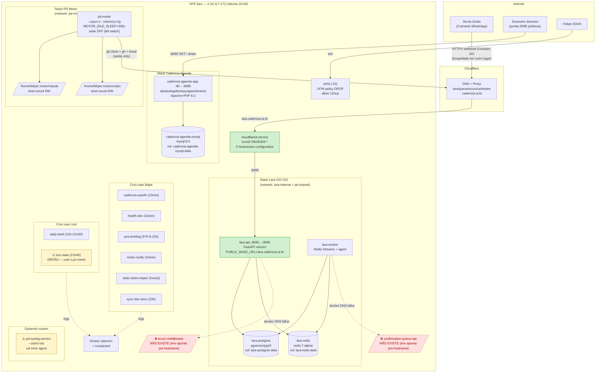

# VPS Dev — arquitetura

> Diagrama C4 mermaid + fluxo real de tráfego. Fonte: `docker inspect`, `docker network inspect`, config do `cloudflared` extraído dos logs do systemd.

## C4 nível container



## Fluxos reais confirmados

### 1. Webhook WhatsApp → Lara GCI-GO (produção viva, cliente encerrado)

```
[tenant Sorria Goiás] → Evolution GO externo (hospedado em outro provedor —
                                                                não é essa VPS)
                     → HTTPS lara.cadencia.ia.br (Cloudflare DNS)
                     → cloudflared tunnel (VPS Dev)
                     → 127.0.0.1:8095
                     → docker-proxy → lara-api:8090
                     → FastAPI processa webhook
                     → enfileira em lara-redis
                     → lara-worker consome, roda agent (OpenRouter gpt-5.4-mini)
                     → tenta chamar ecuro-middleware (FALHA — container sumiu)
                     → tenta chamar confirmation-queue-api (FALHA — sumiu)
                     → grava mensagem em lara-postgres (pgvector)
                     → reconcile.tenant_done nos logs
```

**Modo degradado:** reconcile continua (leitura de mensagens), mas cadeia completa de agendamento via Ecuro API dental está quebrada. A stack processa 3 tenants: `sorria-goias-plano-piloto` (0964f213-*), `sorria-goias-ceilandia` (596f3659-*), `sorria-goias-central` (82bc379f-*). Nenhum existe no Supabase Cadencia — são tenants isolados no Postgres local da Lara (`lara-postgres` volume).

### 2. Motor Autônomo (framework)

```
felipe (SSH) → docker compose start / motor.py on
             → pd-motor sobe worker loop
             → clona pd-framework em /home/motor/pd-framework
             → Claude Code + Codex via CLI (auth em .motor/claude|codex mounts)
             → poll Linear (own:motor issues)
             → git clone + worktree + turnos
             → commit + push pra branch feat/dev-<N>
             → gh pr create
             → devolve o claim ao pool
```

**Estado atual:** subiu OFF por default no reboot (fail-safe do kill switch soberano `motor.py`). Precisa `motor.py on` manual pra trabalhar.

### 3. Cadencia Agenda (Easy!Appointments — POC abandonado)

Endpoint `:8085` recebe GETs de scanners internet (logs mostram User-Agent `Mozilla/5.0 (X11; Ubuntu)`, `Chrome/49`, etc — bots) + acessos legítimos ocasionais. Sem rota `cadencia.ia.br` no Cloudflare tunnel pra ele (não está exposto pelo tunnel).

Provavelmente Luiz deixou porta 8085 aberta pra testar contra tenants Cadencia (DEV-1364 previa Easy!Appointments como provider). **Não é usado por nenhum cliente hoje** (nenhum tenant Cadencia tem esse provider configurado).

### 4. Cron autofix + motor-notify + stale-reaper (framework pd-framework)

Rodam local em `/home/felipe/pd-framework/`, não expõem porta. Interagem com Linear + Motor via CLI. Escrevem em `.pd/*.log`.

## Fluxo de gerência (SSH)

```
felipe local (chave hostinger_dev_felipe)
  → sshd :22
  → grupo felipe (uid 1000) + sudo NOPASSWD
    → docker ps / logs / exec (sudo)
    → journalctl -u cloudflared / pd-syslog
    → crontab -u felipe/-u root
    → /opt/{daily-brief,sync-dev-docs.py}
    → /home/felipe/pd-framework/ (clone do framework)
```

## Componentes que NÃO existem mais (referências mortas no config)

- `ecuro-middleware` (container esperado pelo Lara worker via docker DNS `http://ecuro-middleware:8080`) — sumiu. Env `ECURO_MIDDLEWARE_URL` no `lara-worker` aponta pra hostname que não resolve.
- `confirmation-queue-api` (container esperado pelo Lara worker via `http://confirmation-queue-api:3000`) — sumiu.
- `ue.cadencia.ia.br` (Vite dev :5173) — abandonado.
- `testes.cadencia.ia.br` (localhost :3000) — abandonado.
- `queue.cadencia.ia.br` (:3000) — apontava pra `confirmation-queue-api`; endpoint ativo no Cloudflare mas sem serviço atrás.

**Efeito:** requisições nesses hostnames Cloudflare voltam 5xx/timeout. Não afeta operação atual (nada crítico depende deles).

## Decisões arquiteturais implícitas (não formalizadas em ADR)

- **Cloudflare Tunnel > port forward direto** — VPS Hostinger tem UFW default DROP; tunnel é a única entrada externa. Vantagem: HTTPS grátis, DDoS protection Cloudflare, esconde IP.
- **Sem Coolify na VPS Dev** — só a Master usa. Aqui é `docker compose` manual, o que gera o problema dos compose files sumindo.
- **User luiz + docker group = root efetivo** — enquanto ativo, Luiz podia `docker run -v /:/host` e ler qualquer arquivo. Vetor conhecido, autorizado enquanto era dev interno. Após desligamento, `gpasswd -d luiz docker`.
- **Motor com cap `--cpus=1 --memory=2g`** — decisão explícita em `_core/deploy/motor/compose.yml` pra não competir com o dev interativo do Felipe na mesma VPS.
