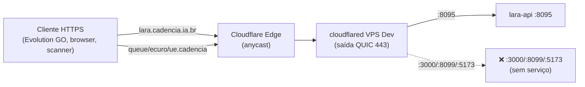

# Cloudflared Tunnel — VPS Dev

> **Tunnel ID:** `09c0b304-dde4-4db1-9f80-5c7ed1353a43` (extraído do token do systemd).
> **Token:** vive no unit `/etc/systemd/system/cloudflared.service` como arg `--token`. **Copiar via 1P quando for movimentar** — não colocar no framework.
> **Status atual (2026-07-31):** active desde 20:22:54 UTC (subiu no reboot com policy `enabled`).

## O que é

Cloudflare Tunnel — dá pra VPS Dev endpoints públicos HTTPS SEM abrir portas na internet. A VPS abre conexão de SAÍDA pra Cloudflare (`quic` sobre `443`), Cloudflare roteia requests pro tunnel. Zero superfície de ataque direta na VPS (UFW só libera `:22` e `:8085/:8095` locais, os endpoints externos passam pelo Cloudflare).

## Hostnames configurados

Config vive no dashboard Cloudflare (não em arquivo local — validado: `/etc/cloudflared/config.yml` não existe). Extraído dos logs do systemd:

| Hostname | Local target | Container esperado | Status |
|---|---|---|---|
| `lara.cadencia.ia.br` | `http://127.0.0.1:8095` | `lara-api` (via docker-proxy) | ✅ VIVO — usado pelos 3 tenants Sorria Goiás |
| `queue.cadencia.ia.br` | `http://127.0.0.1:3000` | `confirmation-queue-api` (não existe) | ❌ 5xx |
| `ecuro.cadencia.ia.br` | `http://127.0.0.1:8099` | `ecuro-middleware` (não existe) | ❌ 5xx |
| `ue.cadencia.ia.br` | `http://127.0.0.1:5173` | Vite dev server (abandonado) | ❌ 5xx |
| `testes.cadencia.ia.br` | `http://localhost:3000` | Env de testes (abandonado) | ❌ 5xx |
| (default) | `http_status:404` | — | 404 configurado |

DNS `nslookup lara.cadencia.ia.br` retorna IPs Cloudflare (`172.67.132.252`, `2606:4700:*`) — confirma que passa pelo Cloudflare.

## Config real (mermaid)



## Como o systemd sobe

```
/etc/systemd/system/cloudflared.service
  ExecStart=/usr/bin/cloudflared --no-autoupdate tunnel run --token <TOKEN>
  Type=simple
  Restart=(default policy do systemd — sobe no boot)
  Enabled at boot
```

Verificar:
```bash
sudo systemctl status cloudflared --no-pager
sudo journalctl -u cloudflared -n 50
```

## Peculiaridades

- **Sem cert local** — `cloudflared tunnel list` falha porque o binário procura `~/.cloudflared/cert.pem` que não existe (autenticação é via token embutido). Isso é **normal** pra tunnels criados pelo dashboard (não pela CLI). Não tentar `cloudflared login` — quebra a config atual.
- **Config no dashboard, não no `config.yml`** — pra editar rotas, ir em https://one.dash.cloudflare.com → Networks → Tunnels → tunnel `09c0b304-*` → Public Hostname. Cada mudança propaga em segundos.
- **Sem HA** — 1 conector só. Se a VPS Dev cair ou cloudflared morrer, endpoints ficam offline até restart.

## Endpoints mortos (limpar)

`queue`, `ecuro`, `ue`, `testes` — apontam pra portas sem serviço. Poluem monitoring (retornam 5xx toda vez). **Ação recomendada:** deletar hostnames no dashboard Cloudflare + remover DNS records. Ou levantar containers correspondentes (mas os que faltam foram propositalmente descontinuados com o encerramento do cliente GCI-GO).

## Riscos

- **Único ponto de entrada externa da VPS Dev.** Se cloudflared cair, TODA URL externa quebra (Lara offline pros clientes GCI-GO).
- **Token embutido no systemd file** — se `/etc/systemd/system/cloudflared.service` vazar, atacante ganha permissão de proxy pra endpoints internos. Manter arquivo com `chmod 600 root:root`.
- **Regeneração do token = 5min de downtime** — precisa recriar tunnel no dashboard + atualizar systemd + `systemctl daemon-reload && restart`. Não fazer sem janela.

## Recuperação

**Se o tunnel parar:**
```bash
sudo systemctl restart cloudflared
sudo journalctl -u cloudflared -n 30 --no-pager
```

**Se o token vazar/precisar rotate:**
1. Dashboard Cloudflare → Networks → Tunnels → clicar no tunnel
2. Configure → Rotate token
3. Copiar novo token
4. Na VPS: `sudo nano /etc/systemd/system/cloudflared.service` → trocar valor do `--token`
5. `sudo systemctl daemon-reload && sudo systemctl restart cloudflared`
6. Salvar novo token no 1P (item `Cloudflare - Tunnel VPS Dev`)

**Se todo o tunnel morrer (config corrompida):**
- Recriar no dashboard, novos DNS records automaticamente, nova config, novo token, atualizar systemd file.
- Downtime: ~10min. Não afeta outras stacks (só Lara GCI-GO exposta).

## Refs

- Dashboard: https://one.dash.cloudflare.com/ → Networks → Tunnels
- Systemd unit: `/etc/systemd/system/cloudflared.service`
- Doc oficial: https://developers.cloudflare.com/cloudflare-one/connections/connect-networks/
