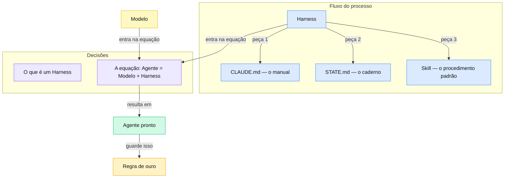

# Teste — Diagrama Mermaid (Canvas convertido)

Diagrama gerado automaticamente a partir do Canvas Obsidian `01-harness.canvas`.

```mermaid
flowchart TD
    classDef decision fill:#EDE9FE,stroke:#8B5CF6,color:#111
    classDef component fill:#D1FAE5,stroke:#10B981,color:#111
    classDef external fill:#FEF3C7,stroke:#F59E0B,color:#111
    classDef warning fill:#FEF9C3,stroke:#EAB308,color:#111
    classDef flow fill:#DBEAFE,stroke:#3B82F6,color:#111

    agente["Agente pronto"]
    class agente component

    subgraph SG_flow["Fluxo do processo"]
        harness["Harness"]
        claudemd["CLAUDE.md — o manual"]
        statemd["STATE.md — o caderno"]
        skill["Skill — o procedimento padrão"]
    end
    class harness,claudemd,statemd,skill flow

    subgraph SG_decision["Decisões"]
        titulo["O que é um Harness"]
        equacao["A equação: Agente = Modelo + Harness"]
    end
    class titulo,equacao decision

    regra["Regra de ouro"]
    class regra external

    modelo["Modelo"]
    class modelo warning

    modelo -->|"entra na equação"| equacao
    harness -->|"entra na equação"| equacao
    equacao -->|"resulta em"| agente
    harness -->|"peça 1"| claudemd
    harness -->|"peça 2"| statemd
    harness -->|"peça 3"| skill
    agente -->|"guarde isso"| regra
```
