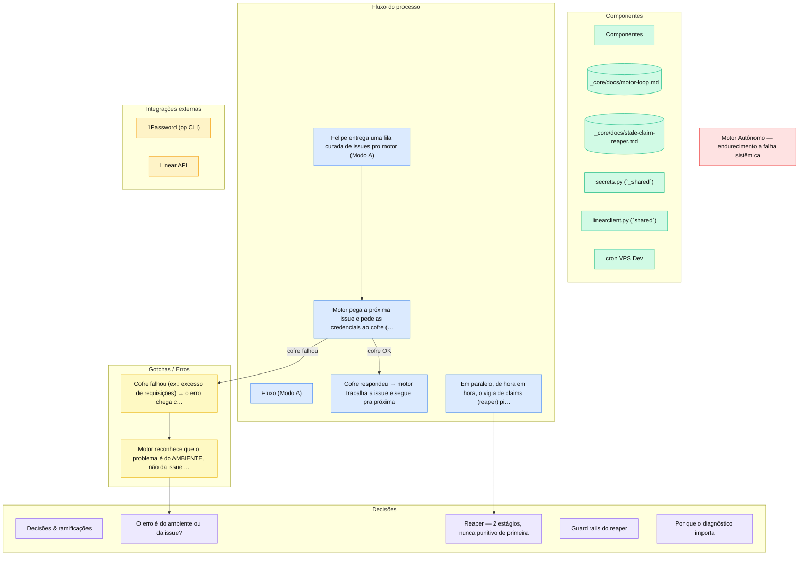

# Motor Loop

> Daemon que executa ciclos autônomos em série — Modo B (24/7 com kill switch) ou Modo A (fila curada pelo Felipe) — agora com fail-fast em falha de ambiente.

**Path:** `_core/motor_loop.py`
**Issues:** DEV-1132, DEV-1134/1135/1136/1137, DEV-1300 (Modo A), DEV-1345/1346 (endurecimento a falha sistêmica)

## Por que foi construído assim

O loop é serial por design (um ciclo por vez) — reduz colisão de worktree, claim e budget enquanto a confiança do motor amadurece. PR em review não bloqueia a próxima issue (aprovação assíncrona), e o motor nunca mergeia em produção — entrega PR ou branch conforme a matriz de alçada.

O endurecimento de 2026-07-16 nasceu de incidente real: com o 1Password rate-limitado, o Modo A queimou uma fila de 18 issues em 5 segundos, todas com o mesmo erro de credencial **disfarçado** de "LINEAR_API_KEY não encontrada". Dois problemas distintos: o diagnóstico mentia (DEV-1345) e o loop tratava falha de ambiente como falha de issue, insistindo e agravando o rate-limit (DEV-1346).

## Stack

| Camada | Tecnologia |
|---|---|
| Linguagem | Python 3.12, stdlib-first |
| Credenciais | 1Password via `_shared/secrets.py` (cascata env → op.env → op CLI) |
| Fila/estado | Linear (GraphQL via `_shared/linear_client.py`) |
| Onde roda | VPS Dev — container `pd-motor` (Modo B) ou processo avulso (Modo A) |

## Como funciona



**Modo B (daemon):** a cada iteração consulta o kill switch (`motor.is_enabled(fresh=True)`). OFF → idle; ON → `motor_run.run_cycle()` (seleciona issue `own:motor`, claima, abre worktree, roda harness, abre PR ou libera). Loop infinito até kill switch OFF ou SIGTERM.

**Modo A (curadoria explícita):** `motor_loop.py run --issues DEV-X DEV-Y` — processa só a lista fornecida, na ordem, e encerra ao zerar. Bypassa o kill switch: a presença de `--issues` é a permissão explícita do Felipe.

**Fail-fast (DEV-1346):** todo erro de ciclo é classificado em **sistêmico** (credencial, rede — derruba qualquer issue) ou **da issue** (ex.: worker declarou bloqueio). Sistêmico em Modo A aborta a fila imediatamente com exit code 3 e reporta quantas issues nem foram tentadas; em Modo B vira idle estendido em vez de martelar a causa. Erro da issue mantém o comportamento antigo: registra e segue pra próxima.

**Diagnóstico honesto (DEV-1345):** quando o op CLI do 1Password falha, o stderr real (rate-limit, vault sem acesso, token expirado) viaja na exceção até o log — "credencial não configurada" e "1Password fora do ar" agora são mensagens diferentes.

## Decisões técnicas

- **Erro de ambiente ≠ erro de issue** — insistir na fila com o ambiente quebrado só queima ciclos e agrava a causa (o resolve de credencial re-tenta o `op` por issue). Abortar cedo com relato claro é mais barato que 18 erros idênticos mudos.
- **Exit code 3 dedicado** — "abortado por infra" é distinguível de "houve erros por issue" (exit 1) pra qualquer orquestrador em cima do loop.
- **Falha operacional nunca vira mensagem genérica** — regra do `_shared` desde os incidentes de 04/07 (credencial falhando mudo), agora aplicada também ao caminho do op CLI.
- **Modo A bypassa kill switch intencionalmente** — curadoria explícita = permissão explícita.

## Gotchas & armadilhas

- **Heurística de erro sistêmico é por tipo + substring** (`API_KEY`, `rate-limit`, `credencial`...) — mensagem de erro de issue contendo essas palavras dispara falso-positivo; o efeito é conservador (aborta a fila), mas ajuste a heurística em vez de removê-la.
- **`run --once` pode demorar minutos** com o harness trabalhando — timeout de shell não é necessariamente falha.
- **Logs do Modo A** vão pra `motor-a.out.log` no container, não pro `docker logs` — a skill `/logar-motor` detecta o modo e traz o log certo.
- **Modo A não exige label `own:motor`** — o `--issues` claima qualquer issue da lista.

## Como operar

```bash
# Modo A — fila curada
python _core/motor_loop.py run --issues DEV-477 DEV-496

# Modo B — daemon (container pd-motor)
python _core/motor_loop.py run

# Self-test (inclui os cenários de fail-fast F/G/H)
python _core/motor_loop.py --self-test
```

Skills de operação: `/ligar-motor`, `/desligar-motor`, `/logar-motor`.

## FAQ

**O motor parou no meio da fila do Modo A — perdi as issues restantes?**
Não. O abort sistêmico só *não tenta* as restantes — elas continuam na fila do Linear intocadas. Resolva a causa (ex.: esperar o rate-limit do 1P passar) e rode o Modo A de novo com a lista restante (o `stats` do run abortado lista quais foram puladas).

**Como sei se o run falhou por infra ou pelas issues?**
Exit code: 3 = abortado por infra (`aborted_systemic` no stats); 1 = uma ou mais issues falharam individualmente; 0 = tudo ok.

**Por que não re-tentar com backoff em vez de abortar?**
A spec do DEV-1346 aceitava as duas; abortar foi escolhido por ser mais simples e porque Modo A sempre tem um humano por perto (é curadoria explícita) — relatar rápido > insistir às cegas.

## Refs

- Vigia de claims: [Stale-Claim Reaper](stale-claim-reaper.md)
- Docs repo: `_core/docs/motor-loop.md` · `_core/MOTOR-AUTONOMO.md` · `_core/PR-ESCALATION-MATRIX.md`
- Sessão do endurecimento: `sessions-log/2026-07-16/motor-fix-dev-1344-1345-1346-reaper-diagnostico-fail-fast_2026-07-16_0009.md`

---
Fonte repo: `pd-framework/_core/docs/motor-loop.md`

## Notas Relacionadas
[[Motor-Autonomo]] - [[Motor-Loop]]
