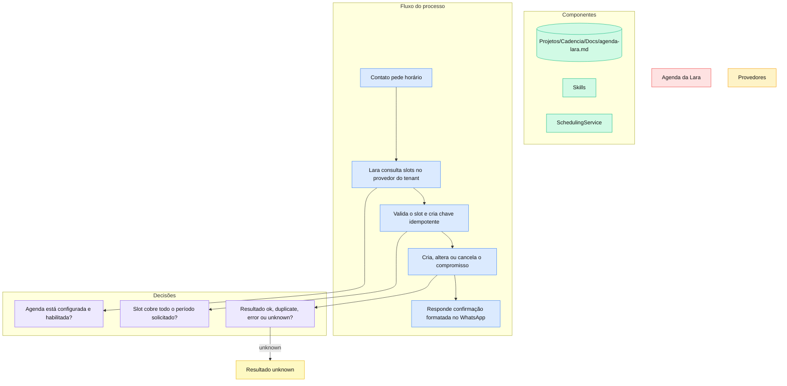

# Agenda da Lara

> Camada única de disponibilidade, criação, alteração e cancelamento de compromissos para Google Calendar, Cal.com e Easy!Appointments.

## Por que foi construído assim

Cada provedor tem autenticação, formato de slot e semântica de falha diferentes. A Lara usa um contrato comum (`SchedulingPlugin`) e uma camada de serviço para idempotência, auditoria e handoff. Assim, as skills conversacionais não precisam conhecer detalhes de Google Calendar, Cal.com ou Easy!Appointments.

Mutação com resultado incerto não é repetida automaticamente. Em um timeout, 429 ou 5xx, o provedor pode ter criado o compromisso mesmo sem devolver confirmação; repetir cegamente produziria duplicatas.

## Stack

| Componente | Tecnologia |
|---|---|
| Contrato e orquestração | FastAPI, `SchedulingPlugin`, `SchedulingService` |
| Google | Google Calendar API v3 |
| Cal.com | API v2, hosted ou self-hosted |
| Easy!Appointments | API REST |
| Configuração | `lara_scheduling_config` no Supabase |
| Segurança | Credenciais JSON cifradas no backend |

## Como funciona

O tenant define provedor, calendário ou event type, fuso, duração, horário comercial e credencial. As skills consultam disponibilidade antes de agendar e formatam a confirmação em pt-BR. A mesma disponibilidade é consumida por condições `slot_available` nas cadências de contatos.

## Decisões técnicas

- Leituras com falha retornam `error` retryable, nunca `unknown`.
- Mutações com resposta incerta retornam `unknown` e exigem verificação ou handoff humano.
- Cancelar compromisso já ausente é sucesso idempotente.
- Google usa a chave idempotente como `eventId`; HTTP 409 representa replay.
- Cal.com recebe a chave e aceita ambiente hosted ou self-hosted.
- Easy!Appointments usa service/provider configurados e também atende o endpoint de disponibilidade das cadências.
- Datas sem timezone são interpretadas no fuso do tenant, com default `America/Sao_Paulo`.

## Gotchas & armadilhas

- `unknown` significa que o compromisso pode existir; não repetir automaticamente.
- Credenciais são cifradas e nunca retornam ao painel.
- O backend suporta Easy!Appointments, mas o tipo e o dropdown atuais do `cadencia-app` mostram apenas GCal e Cal.com.
- Cal.com usa versões e headers diferentes entre slots e bookings.
- `business_hours` é configuração local; a disponibilidade final continua sendo a resposta do provedor.
- Agenda desabilitada ou incompleta deve produzir resposta controlada, não slot vazio inventado.

## Como operar

1. Em **Lara > Ferramentas/Agenda**, escolha o provedor e informe calendário ou event type.
2. Configure fuso, duração, horário comercial e credencial do provedor.
3. Habilite a agenda e consulte disponibilidade no Playground.
4. Teste criação, alteração e cancelamento com a mesma chave para verificar idempotência.
5. Em resultado `unknown`, consulte o provedor antes de repetir a ação.
6. Para Easy!Appointments, configure via backend/API enquanto o gap do formulário não for fechado.

Validação técnica: `pytest -q tests/scheduling tests/test_dev1270_skills.py` no `cadencia-lara`.

## FAQ

**Quais provedores estão implementados?**  
Google Calendar, Cal.com e Easy!Appointments.

**Por que Easy!Appointments não aparece no formulário?**  
O backend já suporta o provider, mas a tipagem e o dropdown atuais ainda não foram atualizados.

**Posso repetir uma criação após timeout?**  
Não automaticamente. Primeiro confirme no provedor, pois a mutação pode ter sido aplicada.

**Cadências usam essa agenda?**  
Sim. Passos condicionais podem consultar disponibilidade pelo endpoint administrativo da Lara.

