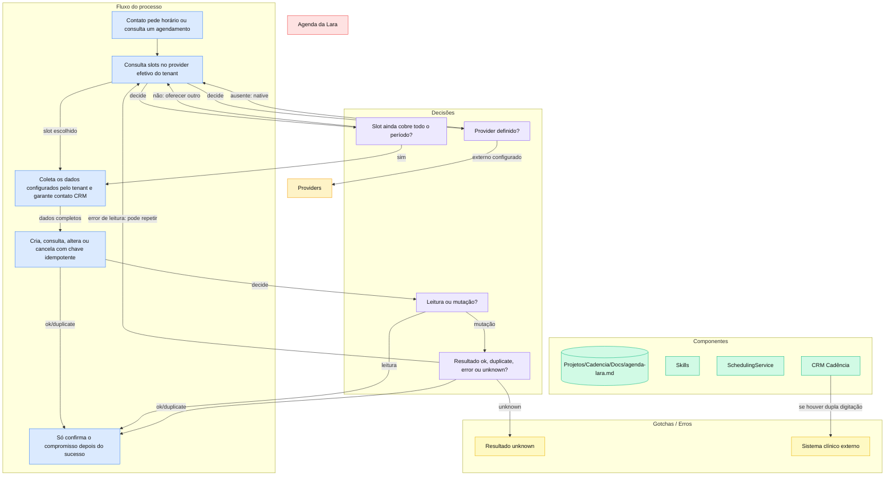

# Agenda da Lara

> Agenda Cadência nativa por default, com contrato único para consultar, criar, alterar e cancelar
> compromissos; Google Calendar e Cal.com são providers opcionais implementados e cobertos por testes.
> Easy!Appointments também está implementado com testes mockados, mas ainda aguarda E2E contra
> ambiente vivo.

## Por que foi construído assim

A Lara precisa agendar sem obrigar o cliente a obter OAuth ou contratar outra agenda. Por isso o
provider `native`, persistido no próprio Supabase Cadência, é o default zero-config. Integrações
externas continuam disponíveis atrás do mesmo contrato quando o negócio já depende delas.

O serviço centraliza idempotência, auditoria e resultado incerto. Timeout, 429 ou 5xx numa mutação pode
significar que o compromisso foi criado sem resposta; repetir automaticamente produziria duplicatas.

## Stack

| Componente | Tecnologia |
|---|---|
| Contrato/orquestração | FastAPI, `SchedulingPlugin`, `SchedulingService` |
| Agenda default | Supabase `appointments` + `lara_scheduling_config` |
| Providers externos | Google Calendar v3, Cal.com v2; Easy!Appointments REST com E2E vivo pendente |
| CRM | Contatos Cadência vinculados ao appointment |
| Segurança | Credenciais JSON cifradas no backend |
| Onde roda | `cadencia-lara` na VPS Master; página pública no `cadencia-app` |

## Como funciona

```mermaid
flowchart TD
    classDef component fill:#D1FAE5,stroke:#10B981,color:#111
    classDef flow fill:#DBEAFE,stroke:#3B82F6,color:#111
    classDef decision fill:#EDE9FE,stroke:#8B5CF6,color:#111
    classDef core fill:#FEE2E2,stroke:#EF4444,color:#111
    classDef external fill:#FEF3C7,stroke:#F59E0B,color:#111
    classDef warning fill:#FEF9C3,stroke:#EAB308,color:#111

    subgraph SG_component["Componentes"]
        ui[("Projetos/Cadencia/Docs/agenda-lara.md")]
        skills["Skills"]
        service["SchedulingService"]
        crm["CRM Cadência"]
    end
    class ui,skills,service,crm component

    subgraph SG_flow["Fluxo do processo"]
        request["Contato pede horário ou consulta um agendamento"]
        availability["Consulta slots no provider efetivo do tenant"]
        identity["Coleta os dados configurados pelo tenant e garante contato CRM"]
        mutate["Cria, consulta, altera ou cancela com chave idempotente"]
        reply["Só confirma o compromisso depois do sucesso"]
    end
    class request,availability,identity,mutate,reply flow

    subgraph SG_decision["Decisões"]
        provider["Provider definido?"]
        free["Slot ainda cobre todo o período?"]
        operation["Leitura ou mutação?"]
        result["Resultado ok, duplicate, error ou unknown?"]
    end
    class provider,free,operation,result decision

        title["Agenda da Lara"]
    class title core

        providers["Providers"]
    class providers external

    subgraph SG_warning["Gotchas / Erros"]
        handoff["Resultado unknown"]
        manual["Sistema clínico externo"]
    end
    class handoff,manual warning

    request --> availability
    availability -->|"slot escolhido"| identity
    identity -->|"dados completos"| mutate
    mutate -->|"ok/duplicate"| reply
    availability -->|"decide"| provider
    provider -->|"ausente: native"| availability
    provider -->|"externo configurado"| providers
    availability -->|"decide"| free
    free -->|"sim"| identity
    free -->|"não: oferecer outro"| availability
    mutate -->|"decide"| operation
    operation -->|"leitura"| reply
    operation -->|"mutação"| result
    result -->|"ok/duplicate"| reply
    result -->|"unknown"| handoff
    result -->|"error de leitura: pode repetir"| availability
    crm -->|"se houver dupla digitação"| manual
```

Sem configuração explícita, `native` calcula disponibilidade a partir do horário comercial do tenant
menos appointments ativos. Criar agenda o compromisso e garante/vincula o contato do CRM. A página
pública `/agendar/[slug]` usa endpoints server-to-server; o lead não acessa a API administrativa.

As skills verificam slot e só confirmam depois de sucesso. O schema genérico aceita nome, início,
duração, telefone, email, assunto, local e observação, mas não marca esses campos como obrigatórios;
regras adicionais de coleta pertencem à configuração/prompt do tenant e não são enforcement da tool.
A consulta de agendamento lê o estado persistido; o alias legado `agendar` fica oculto para não
duplicar tools.

## Decisões técnicas

- `native` é default e zero-config; providers externos são escolha explícita.
- Unique parcial protege chave idempotente e conflito de slot no Postgres.
- Leituras falham como `error` retryable; mutações ambíguas falham como `unknown` sem retry cego.
- Datas sem timezone usam o fuso do tenant; default `America/Sao_Paulo`.
- Credenciais externas ficam cifradas e nunca retornam ao painel.
- Cadências consultam a mesma disponibilidade pelo adaptador administrativo da Lara.

## Gotchas & armadilhas

- **`unknown` não é falha definitiva** — o compromisso pode existir; humano deve conferir.
- **Sistema externo não sincronizado** — dupla digitação manual pode deixar o Cadência desatualizado e
  permitir overbooking.
- **Easy!Appointments ainda não tem prova ao vivo** — backend implementado e testes mockados, mas o
  E2E contra ambiente real está pendente; o formulário também não expõe esse provider.
- **Cal.com varia headers/versões** — slots e bookings não compartilham contrato HTTP idêntico.
- **Horário comercial não basta** — provider e appointments ainda determinam o slot final.

## Como operar

1. Use `native` para a agenda Cadência sem credenciais; configure horário/fuso/duração quando necessário.
2. Se usar provider externo, selecione-o e grave credenciais somente pelo backend.
3. Valide disponibilidade e consulta no Playground.
4. Teste criação/cancelamento num tenant de teste, inclusive replay idempotente e slot ocupado.
5. Em `unknown`, consulte o provider antes de qualquer nova mutação.
6. Se existir sistema clínico externo, defina integração ou controle formal da dupla digitação.

Validação técnica: `pytest -q tests/scheduling/test_native.py tests/test_dev1364_booking_endpoints.py
tests/test_dev1459_provider_default.py tests/test_dev1581_vincular_contato.py
tests/test_dev1588_consultar_agendamento.py`.

## FAQ

**Qual agenda funciona sem configuração?**
A agenda Cadência (`native`), sem OAuth ou chave externa.

**Quais providers externos estão implementados?**
Google Calendar e Cal.com estão implementados e cobertos por testes do repositório. Easy!Appointments
também está implementado com mocks, mas o E2E contra ambiente vivo segue explicitamente pendente.

**Posso repetir uma criação após timeout?**
Não automaticamente. Primeiro confirme no provider, pois a mutação pode ter sido aplicada.

**Agendamento cria o contato?**
Sim. A skill garante o contato no CRM e vincula o appointment quando há sucesso.

**A agenda da Lara sincroniza um sistema clínico externo?**
Somente se existir integração específica. Cópia manual não atualiza automaticamente a disponibilidade.
