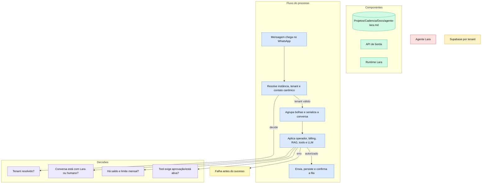

# Agente Lara

> Atendente WhatsApp multi-tenant do Cadência, com operação humana, conhecimento, ferramentas, agenda, mídia, uso e billing em uma única superfície.

## Por que foi construído assim

A Lara foi separada em duas responsabilidades. O `cadencia-app` autentica o usuário, resolve o tenant no servidor e oferece a interface. O `cadencia-lara` recebe webhooks, serializa conversas, executa o agente e persiste os resultados. Essa divisão impede que o browser escolha um `tenant_id`, conheça chaves administrativas ou determine a instância de WhatsApp.

O runtime usa fila durável e debounce para agrupar mensagens consecutivas. A resposta só confirma a fila depois de persistir e enviar com sucesso; falhas anteriores permanecem recuperáveis. O takeover humano, o billing e os limites mensais são gates do backend, não apenas controles visuais.

## Stack

| Camada | Tecnologia |
|---|---|
| Interface e API de borda | Next.js 15, React 19, Supabase Auth/Realtime |
| Runtime | FastAPI, Python, OpenAI-compatible LLMs |
| Canal | Evolution API / WhatsApp |
| Estado | Supabase PostgreSQL e Storage |
| Conhecimento | RAG, FAQ, URL, arquivos e `style_digest` |
| Extensões | Tools HTTP/MCP, skills first-party e agenda |

## Como funciona

O painel `/app/lara` reúne Conversas, Agente, Conhecimento, Ferramentas, Operador, Conexão, Playground e Dashboard administrativo. Conversas usam Realtime e polling de 6 segundos como fallback, suportam mídia, outbox otimista com retry, takeover bot/humano, não lidas, merge LID/telefone e deep-link responsivo.

## Decisões técnicas

- `laraGuard()` autentica, resolve o tenant e valida a feature flag em toda API protegida.
- O browser nunca envia o tenant efetivo nem recebe `LARA_ADMIN_KEY` ou `LARA_SUPER_ADMIN_KEY`.
- Ferramentas HTTP/MCP usam schema, cofre de segredos, proteção SSRF, aprovação e kill switch.
- Conhecimento livre, FAQ, URL, arquivos e perguntas recorrentes alimentam a mesma base por tenant.
- Cobrança considera conversa iniciada; metering, saldo e cap mensal são aplicados antes da geração.
- Abas visitadas permanecem montadas e URL/contato sobrevivem a refresh e navegação.

## Gotchas & armadilhas

- Esconder a navegação não autoriza acesso; o gate deve existir em cada rota da API.
- Erro de backend não pode ser apresentado como estado vazio.
- Realtime pode cair silenciosamente, por isso o polling não deve ser removido.
- `activeRef` precisa mudar no mesmo tick da abertura da conversa para não descartar a primeira resposta.
- Mídia assinada pode exigir fetch como blob; a URL interna não é link permanente.
- Aprovação de tool e kill switch pertencem ao super_admin.
- O runtime antigo de cadências dentro da Lara foi aposentado; Lara hoje é adaptador de canal e agenda.

## Como operar

1. Habilite `flag_lara_enabled` no tenant e configure a instância.
2. Em **Conexão**, gere o QR e confirme o estado conectado.
3. Em **Agente**, configure prompt, modelo permitido, temperatura, greeting, limites e guardrails.
4. Cadastre conhecimento e aprove respostas mineradas antes de publicá-las na KB.
5. Cadastre tools por referência de segredo e envie para aprovação quando necessário.
6. Configure operador, agenda e skills; valide no Playground antes de usar uma conversa real.
7. Acompanhe conexão, uso e billing no dashboard administrativo.

Validação técnica: `npm run build` no `cadencia-app` e `pytest -q` no `cadencia-lara`.

## FAQ

**A Lara pode escolher outro tenant ou outra instância pelo payload?**
Não. A API de borda e o backend resolvem ambos no servidor.

**O operador humano consegue assumir uma conversa?**
Sim. O modo é persistido por conversa e o runtime deixa de responder enquanto estiver em atendimento humano.

**Ferramentas MCP podem ser ativadas diretamente pelo cliente?**
Não quando exigem análise. Aprovação e kill switch são controles administrativos.

**O que acontece se enviar a resposta e falhar antes do ACK?**
A mensagem permanece recuperável na fila; o fluxo foi desenhado para não confirmar trabalho incompleto.
