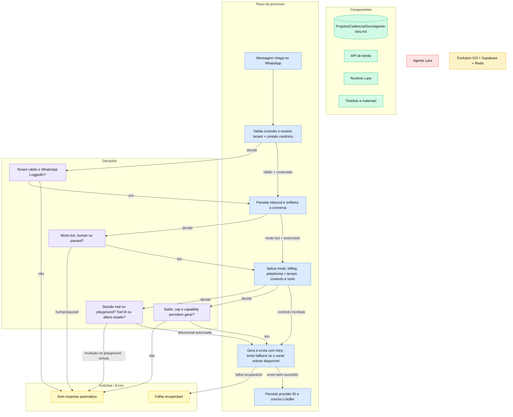

# Agente Lara

> Atendente WhatsApp multi-tenant do Cadência, com operação humana, prompt em camadas, conhecimento,
> ferramentas, agenda, materiais, timeline e billing em uma única superfície.

## Por que foi construído assim

A Lara separa interface e runtime. O `cadencia-app` autentica o usuário, resolve o tenant no servidor
e oferece o painel. O `cadencia-lara` recebe webhooks Evolution GO/whatsmeow, serializa conversas,
executa o agente e persiste os resultados. O browser nunca escolhe o tenant, conhece chaves
administrativas ou determina a instância do WhatsApp.

O runtime persiste o inbound antes dos gates e usa Stream + buffer durável de debounce. O `XACK` do
Stream acontece após a transferência ao buffer; a conclusão do turno controla separadamente o commit
desse buffer. Política global e instrução do tenant são camadas diferentes: o cliente personaliza seu
atendimento sem apagar as regras da plataforma.

## Stack

| Camada | Tecnologia |
|---|---|
| Interface e API de borda | Next.js 15, React 19, Supabase Auth/Realtime |
| Runtime | Python, FastAPI, OpenAI-compatible LLMs |
| Canal | Evolution GO/whatsmeow, uma instância por tenant |
| Estado/fila | Supabase PostgreSQL + Storage, Redis Streams |
| Conhecimento | Texto fixado, RAG, FAQ, URL/arquivos e `style_digest` |
| Extensões | Tools HTTP/MCP, skills, materiais e agenda |
| Onde roda | Vercel (`cadencia-app`) e VPS Master/Coolify (`cadencia-lara`) |

## Como funciona

```mermaid
flowchart TD
    classDef component fill:#D1FAE5,stroke:#10B981,color:#111
    classDef flow fill:#DBEAFE,stroke:#3B82F6,color:#111
    classDef decision fill:#EDE9FE,stroke:#8B5CF6,color:#111
    classDef core fill:#FEE2E2,stroke:#EF4444,color:#111
    classDef external fill:#FEF3C7,stroke:#F59E0B,color:#111
    classDef warning fill:#FEF9C3,stroke:#EAB308,color:#111

    subgraph SG_component["Componentes"]
        panel[("Projetos/Cadencia/Docs/agente-lara.md")]
        api["API de borda"]
        runtime["Runtime Lara"]
        timeline["Timeline e materiais"]
    end
    class panel,api,runtime,timeline component

    subgraph SG_flow["Fluxo do processo"]
        inbound["Mensagem chega no WhatsApp"]
        resolve["Valida conexão e resolve tenant + contato canônico"]
        persist["Persiste inbound e enfileira a conversa"]
        reason["Aplica modo, billing, plataforma > tenant, contexto e tools"]
        send["Gera e envia com retry; tenta fallback se o canal estiver disponível"]
        finish["Persiste provider ID e conclui o buffer"]
    end
    class inbound,resolve,persist,reason,send,finish flow

    subgraph SG_decision["Decisões"]
        connected["Tenant válido e WhatsApp LoggedIn?"]
        mode["Modo bot, human ou paused?"]
        limit["Saldo, cap e capability permitem gerar?"]
        tool["Sessão real ou playground? Tool lê ou altera estado?"]
    end
    class connected,mode,limit,tool decision

        title["Agente Lara"]
    class title core

        evolution["Evolution GO + Supabase + Redis"]
    class evolution external

    subgraph SG_warning["Gotchas / Erros"]
        stop["Sem resposta automática"]
        recover["Falha recuperável"]
    end
    class stop,recover warning

    inbound --> resolve
    resolve -->|"válido + conectado"| persist
    persist -->|"modo bot + autorizado"| reason
    reason -->|"contexto montado"| send
    send -->|"envio bem-sucedido"| finish
    resolve -->|"decide"| connected
    connected -->|"não"| stop
    connected -->|"sim"| persist
    persist -->|"decide"| mode
    mode -->|"bot"| reason
    mode -->|"human/paused"| stop
    reason -->|"decide"| limit
    limit -->|"sim"| send
    limit -->|"não"| stop
    reason -->|"decide"| tool
    tool -->|"leitura/real autorizada"| send
    tool -->|"mutação no playground: simula"| stop
    send -->|"falha recuperável"| recover
```

O painel `/app/lara` reúne nove superfícies: Conversas, Agente, Conhecimento, Ferramentas, Materiais,
Operador, Conexão, Playground e Dashboard. A timeline representa texto, mídia, localização, contato,
reply, reação, eventos e cards internos sem transformar tool/system/error em mensagem para o paciente.

O agente recebe política global, prompt do tenant, data/hora, conhecimento fixado, estilo, RAG,
identidade e histórico, nessa ordem. Modelo salvo é uma preferência; allowlist e default globais
definem o modelo efetivo. No playground, apenas tools de leitura executam; mutações são simuladas.

## Decisões técnicas

- `laraGuard()` autentica, resolve tenant e valida a flag em cada rota protegida.
- O browser nunca recebe `LARA_ADMIN_KEY`, `LARA_SUPER_ADMIN_KEY` ou token Evolution.
- Contato é canonicalizado antes de dedupe, fila, billing e timeline; LID é alias.
- Tools HTTP/MCP usam schema, cofre, SSRF pinning, aprovação, auditoria e kill switch.
- Biblioteca de materiais separa arquivo, forma de envio (`send_as`) e orientação (`send_when`).
- Cobrança é por conversa iniciada; metering/cap continuam controles distintos.
- O scheduler de cadências vive no `cadencia-growth`; Lara é canal, disponibilidade e sinal inbound.

## Gotchas & armadilhas

- **QR agressivo derruba o provedor** — polling direto abre clientes e esgota Postgres; usar cache de
  12s e disjuntor 10–120s.
- **Instância não significa conexão** — resposta só é permitida quando Evolution informa `LoggedIn`.
- **Prompt do tenant não é política** — não copiar a camada global para o textarea do cliente.
- **Modelo salvo pode ser inválido** — sempre observar `effective_model`, não apenas o campo do tenant.
- **HTTP 200, XACK e commit não são sinônimos** — o Stream é confirmado após entrar no buffer; o
  buffer é concluído separadamente ao fim do turno.
- **Fallback depende do canal** — se Evolution falhar no envio normal e no fallback, o runtime atual
  apenas registra o erro; ainda não persiste `needs_owner` para esse caso.
- **URL de mídia não é permanente** — Storage é privado e o painel usa URL assinada/blob.
- **Playground não prova mutação** — agendar, cancelar, handoff e materiais são simulados ali.

## Como operar

1. Habilite `flag_lara_enabled` e defina preset/capabilities pelo super_admin.
2. Em **Conexão**, use QR ou código de pareamento e confirme `LoggedIn`.
3. Em **Agente**, edite apenas o prompt do tenant e observe o modelo efetivo.
4. Cadastre conhecimento, estilo, tools e materiais; aprove o que exigir revisão.
5. Configure operador e agenda; valide leitura no Playground.
6. Faça mutações em tenant de teste e acompanhe timeline, conexão, uso e billing.

Validação técnica: `npm test -- --run && npm run build` no `cadencia-app`; `pytest -q` no
`cadencia-lara`.

## FAQ

**A Lara pode escolher outro tenant ou instância pelo payload?**
Não. API de borda e backend resolvem ambos no servidor.

**O prompt do cliente substitui as regras da Cadência?**
Não. A política global é injetada primeiro e prevalece.

**Por que o modelo salvo pode não ser o usado?**
O backend restringe modelos à allowlist global e cai no default seguro.

**O operador humano consegue assumir uma conversa?**
Sim. O modo é persistido por conversa; inbound continua salvo, mas o bot não responde.

**A Lara pode enviar um material porque o prompt mandou?**
Somente por `enviar_material` e após sucesso do Evolution. `send_when` orienta, não comprova envio.
