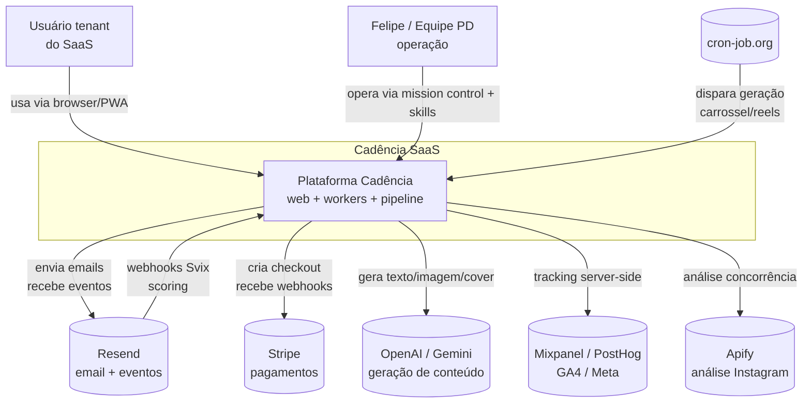

# Arquitetura — Cadência

> Diagrama C4 (Context + Container) em mermaid. Renderiza no GitHub preview e na wiki HTML.

## Nível 1 — Contexto (quem usa, com o que conecta)



## Nível 2 — Containers

```mermaid
graph TB
    Usuario[Usuário]
    Resend[(Resend)]
    Stripe[(Stripe)]
    LLM[(OpenAI / Gemini)]
    Cron[(cron-job.org)]

    subgraph Vercel [Vercel — Next.js]
        Frontend[Frontend<br/>Next.js 15 + React 19<br/>app + admin + marketing + onboarding]
        ApiRoutes[API Routes<br/>auth + billing + trigger<br/>webhooks + capi + stevo]
        LaraPanel[Rotas do painel Lara<br/>conversas + agente + KB + tools]
        CadenceBuilder[Rotas de Cadências<br/>construtor + gatilhos + matrícula]
    end

    subgraph Workers [Coolify VPS Master — Workers Python]
        Workers[cadencia-workers<br/>FastAPI + Playwright<br/>orchestrator 7-step<br/>carrossel + reels + chat + onboarding]
    end

    subgraph VPS [VPS Master 72.60.4.71]
        Trigger[trigger_server<br/>:39090]
        GrowthCron[growth_pipeline.py<br/>cron 11h BRT]
        Seinfeld[seinfeld + newsletter + linkedin + blog + instagram<br/>scripts pipeline]
        Scoring[resend webhook<br/>:8767]
        Mission[mission_control<br/>:8768]
        CadenceTick[cadence_tick<br/>scheduler único]
        LaraAPI[cadencia-lara<br/>WhatsApp + agenda]
    end

    subgraph Supabase [Supabase Cloud]
        DB[(PostgreSQL + RLS<br/>tenants / posts /<br/>onboarding / plans /<br/>dossier / editorials)]
        Storage[(Storage<br/>images + assets)]
        Auth[(Auth<br/>magic link + senha)]
    end

    Usuario --> Frontend
    Frontend --> LaraPanel
    Frontend --> CadenceBuilder
    Frontend --> ApiRoutes
    ApiRoutes --> DB
    ApiRoutes --> Auth
    ApiRoutes -->|carrossel/reels| Workers
    ApiRoutes -->|blog/seinfeld/linkedin/instagram| Trigger
    Workers --> DB
    Workers --> LLM
    Trigger --> Seinfeld
    GrowthCron --> Seinfeld
    Seinfeld --> DB
    Seinfeld --> Resend
    Seinfeld --> LLM
    Scoring --> DB
    Cron -->|POST /api/app/trigger-generation| ApiRoutes
    Resend -.->|webhook opened/clicked/bounced/complained| Scoring
    ApiRoutes -->|checkout| Stripe
    Stripe -.->|webhook| ApiRoutes
    Mission --> DB
    CadenceBuilder --> DB
    CadenceTick --> DB
    CadenceTick -->|WhatsApp e disponibilidade| LaraAPI
    LaraAPI --> DB
```

## Nível 3 — Componentes principais

Ver `CLAUDE.md` raiz para lista completa dos 28 componentes com paths.

Resumo por área:

| Área | Componentes | Onde roda |
|---|---|---|
| **Frontend** | frontend-app, frontend-admin, frontend-onboarding, frontend-marketing, api-routes, api-auth-provisioning, api-integrations | Vercel |
| **Workers** | pipeline-orchestrator, theme-engine, onboarding-workers, chat-ideias, ideas-generator, instagram-publisher, rag-memory | Coolify VPS Master (Railway DESLIGADO, DEV-638) |
| **Growth (VPS)** | growth-pipeline-runner, seinfeld-email, newsletter, linkedin-generation, blog-instagram-gen, scoring Resend, domínio de email e cadence-engine | VPS Master |
| **Lib/Infra** | lib-integrations, tracking-analytics, payment-billing, supabase-schema, blog-tenant | mix |
| **CRM conversacional** | painel Lara, tools/KB/agenda, cadências de contatos | Vercel + Coolify + VPS Master |

## Decisões arquiteturais

- [ADR-0001](adr/0001-stripe-em-vez-de-asaas.md) — Stripe substituiu Asaas (11/05/2026)
- [ADR-0002](adr/0002-chat-agent-design.md) — Design do chat "Tenho uma ideia"
- [ADR-0004](adr/0004-carrossel-railway-resto-vps.md) — Carrossel/reels em workers dedicados no Coolify VPS Master; blog/seinfeld/linkedin na VPS
- [ADR-0005](adr/0005-location-pit-token-por-tenant.md) — registro histórico do modelo anterior
- [ADR-0006](adr/0006-multi-tenant-rls-supabase.md) — Multi-tenant via RLS Supabase (não DBs separados)

## Fluxos críticos

### Onboarding novo tenant

1. Signup → `tenants` + `users` + `tenant_onboarding` + carteira inicial de créditos.
2. O CRM próprio é semeado com pipelines, stages, tags e campos do tenant.
3. `provision_tenant.py` provisiona domínio Resend e DNS do tenant.
4. Worker `dossier.py` gera dossier de marca
5. Worker `editorials.py` gera 3 editoriais
6. Visual: 15 presets, identity lock para cover (Gemini 2.5 Flash)
7. Pipeline diário começa a rodar quando `onboarding_completed=true`

### Geração diária (cron 11h BRT)

```
growth_pipeline.py
  ├─ sync (tenants + contatos)
  ├─ blog
  ├─ seinfeld --generate (agenda próximo)
  ├─ seinfeld --dispatch (envia hoje)
  ├─ newsletter (só sexta)
  ├─ linkedin
  └─ instagram
```

### Trigger on-demand (usuário aprova ideia)

```
POST /api/app/trigger-generation (Vercel)
  ├─ filtra carrossel/reels → workers Coolify VPS Master
  └─ outros canais → POST VPS:39090/trigger
       └─ run_pipeline(): sync → blog → seinfeld --generate → linkedin → instagram
          (newsletter é silenciosamente pulada — G002)
```

### Scoring (webhook Resend/Svix)

```
Resend envia "email.opened"/"email.clicked"/"email.bounced"/"email.complained"
  └─ POST no handler Svix :8767
       ├─ valida assinatura e deduplica por Svix ID
       ├─ resolve tenant/contato/post pelas tags do envio
       ├─ atualiza score e temperatura no CRM Cadência
       └─ persiste a atribuição em scoring_events
```

### Lara e cadências de contatos

Ver [`features/agente-lara.md`](features/agente-lara.md) e
[`features/cadencias-contatos.md`](features/cadencias-contatos.md). O scheduler único vive no
`cadencia-growth`; a Lara fornece o canal WhatsApp, disponibilidade e sinais inbound/reply.
