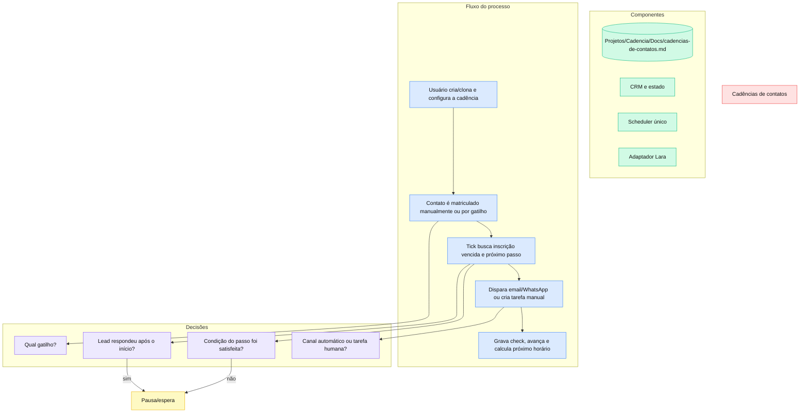

# Cadências de contatos

> Sequências multicanal do CRM próprio do Cadência, com matrícula por gatilhos, execução idempotente e pausa automática após resposta do lead.

## Por que foi construído assim

Cadência e funil são conceitos diferentes. `pipelines` e `pipeline_stages` continuam representando o kanban comercial; cadências apenas definem uma sequência de contatos e podem se associar a um pipeline ou estágio. O estado é dividido entre definição, passos, inscrições e checks para permitir edição segura, execução concorrente e auditoria.

Existe um único scheduler no `cadencia-growth`. O executor experimental que existia na Lara foi removido para evitar dupla matrícula e duplo envio. A Lara permanece como adaptador de WhatsApp, agenda e sinal de inbound/reply.

## Stack

| Camada | Tecnologia |
|---|---|
| Construtor e APIs | Next.js, React, Supabase server client |
| Estado | PostgreSQL: `cadences`, `cadence_steps`, `contact_cadences`, `cadence_step_checks` |
| Scheduler | Python em `cadencia-growth/pipeline/cadence_tick.py` |
| Email | Resend |
| WhatsApp e agenda | Endpoints administrativos do `cadencia-lara` |

## Como funciona

Os gatilhos disponíveis são `manual`, `instant`, `stage`, `inbound_whatsapp` e `outbound_no_reply`. O campo `since` protege a base histórica ao ativar automações. Email e WhatsApp são automáticos; ligação, manual e Instagram geram ações humanas. `offset_minutes` prevalece sobre `day_offset`, sempre relativo ao início da inscrição.

## Decisões técnicas

- Toda inscrição executada pelo scheduler atual recebe `driver='growth'`.
- `cadence_step_checks` possui unicidade por inscrição, passo e ciclo e é a âncora de idempotência.
- A resposta WhatsApp posterior ao início pausa a inscrição antes de qualquer novo envio.
- Templates system são somente leitura para owner e podem ser clonados para customização.
- As cadências 10D Prospecção e FUP Pós-Proposta são semeadas com copy operacional e associação de pipeline.
- Instagram é canal manual, não automação de publicação.
- Migrações removeram `auto_enroll*` somente depois de aposentar o leitor antigo.

## Gotchas & armadilhas

- O cron atual roda uma vez ao dia (`10 14 * * *`, 11:10 BRT). Offsets em minutos não implicam precisão de minutos enquanto a frequência não for aumentada.
- O runtime usa estado `running`; comentários antigos de schema que citam `active` não são contrato atual.
- A migration `20260715190000_cadence_unify_dev1329.sql` apaga linhas de teste com `driver='lara'`; não reaplicar sem verificar o banco.
- `inbound_whatsapp` só matricula contato já existente no CRM.
- O match por oito dígitos finais tolera variações brasileiras, mas pode colidir em outros contextos.
- `slot_available` depende da agenda do tenant e da saúde do endpoint da Lara.
- `[a definir]` é tratado defensivamente como placeholder e não deve existir em templates novos.

## Como operar

1. Abra `/app/cadencias` e crie uma sequência ou clone um template system.
2. Associe o pipeline e, quando aplicável, o estágio do gatilho.
3. Configure `since`, atraso do gatilho e passos com canal, copy, offset e condição.
4. Ative a cadência e matricule manualmente ou aguarde o sweep de gatilhos.
5. Acompanhe estado, passo atual, `next_send_at` e checks no contato.
6. Para diagnosticar, confirme primeiro o cron, depois a inscrição vencida, o check e o adaptador do canal.

Validação técnica: `pytest -q tests/test_cadence_tick.py tests/test_cadence_templates.py` no `cadencia-growth`, testes DEV-757 no `cadencia-lara` e build do `cadencia-app`.

## FAQ

**Ativar uma cadência matricula toda a base antiga?**
Não. O `since` define a fronteira temporal do gatilho.

**Um contato pode receber o mesmo passo duas vezes?**
O check idempotente impede repetição do mesmo passo/ciclo em condições normais.

**O que acontece quando o lead responde no WhatsApp?**
A inscrição em andamento é pausada antes do próximo disparo.

**Por que um passo de cinco minutos pode executar horas depois?**
Porque o scheduler atual é diário. O offset define vencimento, mas a frequência do cron define quando ele será observado.
