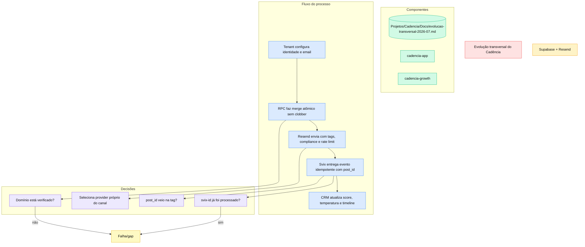

# Evolução transversal do Cadencia — ciclo dev externo 2026-06/07

> Consolidação das entregas de CRM/scoring, email por tenant, onboarding atômico, UX mobile e confiabilidade que acompanharam Lara, agenda e cadências.

## Por que foi construído assim

As mudanças parecem independentes na interface, mas compartilham o mesmo objetivo técnico: consolidar o CRM Cadencia como fonte única e impedir perda de estado em fluxos assíncronos e multi-tenant. Configuração passou a usar merges atômicos; email ganhou domínio e identidade por tenant; eventos carregam a origem do conteúdo; a UI passou a refletir estado real em desktop e mobile.

O caminho de email foi desenhado para tolerar callbacks duplicados e respostas incertas. O webhook responde cedo ao Svix, mas usa idempotência e processamento durável. O provider só é habilitado após verificação do domínio, e writers concorrentes não substituem o objeto inteiro de configuração.

## Stack

| Domínio | Stack |
|---|---|
| CRM e UI | Next.js 15, React 19, Supabase, Tailwind |
| Configuração | PostgreSQL RPC, `tenant_config.config` JSONB |
| Email | Resend, Cloudflare DNS, List-Unsubscribe |
| Scoring | Webhook Svix, Python, Supabase `scoring_events` |
| Integrações | CRM Cadencia, Resend/Svix, DataStone, OpenAI-compatible SDK |

## Como funciona

No CRM, score e temperatura ganharam representação visual e acessível; a timeline usa `post_id` para atribuir eventos ao email correto. O board de oportunidades pagina explicitamente com `.range()`. No onboarding, `merge_tenant_config` e `merge_tenant_config_email` preservam mudanças concorrentes.

No runtime de growth, o envio carrega tags, respeita rate limit e deduplica retries. O webhook normaliza eventos, deduplica por `svix-id`, recupera tags ausentes pela API do Resend e drena processamento no shutdown.

## Decisões técnicas

- `config.email` é canônico; chaves flat são apenas espelho de transição.
- RPCs de merge são `service_role` only e substituem read-modify-write de JSONB.
- Resend só vira provider após domínio verificado.
- `post_id` atravessa sender, webhook e `scoring_events` para atribuição por conteúdo.
- Responder 200 cedo ao Svix exige idempotência e processamento recuperável.
- Cada canal valida somente a credencial de seu provider atual.
- A base mobile usa safe areas, `dvh`, overflow guard e ações contextuais.

## Gotchas & armadilhas

- Conceder as RPCs a `anon`/`authenticated` quebra a fronteira de segurança.
- Escrever somente nas chaves flat pode recriar drift entre formatos.
- Sem `post_id`, o scoring precisa recorrer ao fallback `/emails/{id}`.
- `range()` do PostgREST é inclusivo; lotes consecutivos não podem repetir o limite.
- Resposta 200 sem dedupe perde a capacidade de retry seguro.
- Domínio com DKIM/SPF mas sem tracking DNS ainda não fecha o ciclo de clique.
- Safe area deve ser validada junto com TabBar, modais e toasts.

## Como operar

1. Verifique `config.email` e o estado do domínio antes de habilitar Resend.
2. Execute o preflight de email e valide envio, unsubscribe, open e click.
3. Confirme `post_id` no envio e em `scoring_events` após o webhook.
4. Monitore duplicatas por `svix-id` e o fallback de tags.
5. Em alterações de onboarding/config, use as RPCs de merge e nunca grave o JSON inteiro.
6. Teste CRM e shell mobile em viewport com safe area e base grande o suficiente para paginar.

## FAQ

**Por que existem chaves flat e `config.email` ao mesmo tempo?**
As flat mantêm leitores legados durante a migração. O objeto aninhado é a fonte canônica.

**Responder 200 antes de processar não perde eventos?**
Não quando o worker mantém processamento durável e idempotência por `svix-id`; sem esses dois requisitos, perderia.

**Quais providers atendem os canais?**
Email usa Resend, WhatsApp usa Lara/Evolution e os demais canais usam suas integrações próprias.

**Como um evento é ligado ao email que o originou?**
Pela tag `post_id`, persistida também em `scoring_events`, com fallback para a API do Resend.
