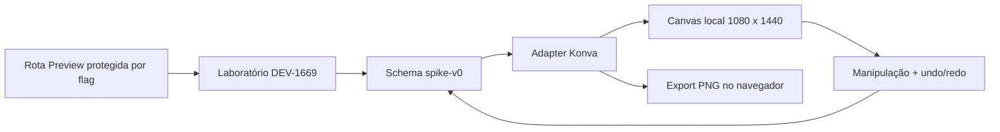

# Editor visual — fundação Konva homologada

> **Estado atual:** a DEV-1669 homologou Konva como engine para a futura RFC do editor visual. O que existe hoje é um laboratório funcional em Preview, não o editor completo e não uma feature habilitada em produção.

## O que foi decidido

- **Konva 10.3 foi homologado** no Next.js 15 + React 19.
- **Fabric.js foi eliminado** porque uma linha do fixture virou barra espessa, apesar do round-trip semântico válido.
- O estado persistido será um contrato próprio do Cadência, como `cadencia.slide-design/v1`, com adapter para Konva.
- O pipeline atual dos workers será preservado. Novos slides precisarão nascer também com uma representação estruturada em camadas.
- A edição será desktop-first; a opção ficará oculta em telas menores que 1024 px.

## O que foi abandonado

A [Epic E / DEV-1412](epic-e-edicao-slide.md) tentou editar texto posicionando campos sobre um PNG e rerenderizando cada save via API, fila, worker Playwright, Storage e polling.

Esse caminho foi reprovado como arquitetura do editor:

1. o PNG é achatado e não contém camadas manipuláveis;
2. `layout_metadata` descreve geometria observada, mas não é um documento editável;
3. cada gesto dependia de processamento assíncrono e bloqueava a interface;
4. a cobertura dos templates era parcial;
5. a experiência não atingiu a resposta imediata esperada de Canva, Miro ou Excalidraw.

O Playwright **não foi descontinuado no produto**. Ele continua válido na geração HTML→PNG dos workers. O que foi descartado é usar worker/Chromium/polling no caminho crítico de cada gesto do usuário.

## Arquitetura validada no spike

O laboratório cobre texto, imagens, retângulo, círculo, linha e seta; seleção, movimento, duplicação, exclusão, reorder, undo/redo, serialização, export e descarte da engine.

## Resultados

| Gate | Resultado final |
|---|---:|
| E2E canônico | 7/7 |
| Grupos adversariais | 14/14 |
| Fuzz determinístico | 600/600 comandos |
| Lifecycle soak | 30/30 ciclos |
| Ready abaixo de 3 s | 14/14 |
| Máximo observado na série final | 2.224 ms |

O primeiro `load()` do Konva altera o antialias de 0,62% dos pixels nas bordas de uma seta/linha. O estado semântico é idêntico e os loads seguintes estabilizam; a diferença permanece no escopo do QA humano visual.

## Contratos e fronteiras

- `cadencia.slide-design/spike-v0` é experimental e não deve ser persistido como schema definitivo.
- O laboratório não escreve no Supabase, não chama worker, não faz upload e não consome créditos.
- O futuro editor não deve conhecer cobrança ou lifecycle da biblioteca de mídia; referencia ativos por `media_asset_id`.
- O renderer atual não deve ser reconstruído nesta fase.
- Produção continua sem `DEV_1669_SPIKE_ENABLED`.

## Próxima etapa

A DEV-1669 autoriza elaborar/seguir a RFC do editor e definir `cadencia.slide-design/v1`, persistência, novos slides estruturados e integração com biblioteca de mídia. Ela não autoriza merge em produção nem significa que a interface final já existe.

## Referências

- Issue Linear: [DEV-1669](https://linear.app/cadencia/issue/DEV-1669/spikeeditor-validar-fabricjs-vs-konva-no-next-15-e-react-19)
- Projeto: [sys: Refundação da geração de conteúdo](https://linear.app/cadencia/project/sys-refundacao-da-geracao-de-conteudo-d8a2d7c8edb9)
- Código: `cadencia-app/docs/features/editor-visual-engine-spike.md`
- Relatório: `cadencia-app/docs/qa/dev-1669-final-qa-report.md`
