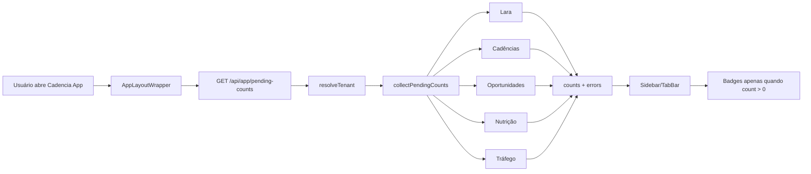

# Sidebar Pending Badges

> DEV-1101 · Feature em implementação no `cadencia-app` para destacar pendências operacionais direto na navegação principal.

## Por que foi construído assim

Antes desta feature, o usuário precisava abrir Lara, Cadências, Oportunidades, Nutrição e Tráfego para descobrir se existia algo pendente. Isso escondia trabalho operacional e atrasava resposta em pontos sensíveis do funil.

A solução concentra a leitura em um endpoint server-side por tenant e entrega um contrato pequeno para a UI renderizar badges. Assim, o menu vira um painel de atenção operacional sem expor service role, tokens ou queries sensíveis no client.

## Stack

| Camada | Tecnologia |
|---|---|
| Linguagem | TypeScript |
| Framework | Next.js App Router |
| Banco | Supabase PostgreSQL |
| UI | React client components no layout/sidebar |
| Integrações | Lara, Cadências, Growth/Oportunidades, Nutrição/Resend, Tráfego/Meta |
| Onde roda | Cadencia App em Vercel |

## Como funciona



O layout client-side chama uma API privada com `cache: no-store`. A rota autentica o usuário, resolve o tenant efetivo com suporte a impersonation de super_admin e chama um agregador server-side.

O agregador consulta as fontes em paralelo e normaliza tudo para `{ count, title }`. Falhas por fonte não derrubam o menu inteiro: a fonte entra em `errors`, gera `console.warn` e retorna count 0 para aquele item.

## Componentes

| Arquivo | Papel |
|---|---|
| `src/lib/pending-counts.ts` | Contrato compartilhado de chaves, labels e helpers de count. |
| `src/lib/pending-counts-server.ts` | Agregador server-side multi-fonte com timeout/fallback por fonte. |
| `src/app/api/app/pending-counts/route.ts` | Endpoint autenticado que resolve tenant e retorna o payload. |
| `src/app/(app)/AppLayoutWrapper.tsx` | Client wrapper que busca contadores e propaga para o layout. |
| `src/components/layout/Sidebar/Sidebar.tsx` | Renderiza badges nos itens mapeados da navegação. |

## Decisões técnicas

- **Endpoint único server-side** — mantém service role e integrações fora do bundle client.
- **Contrato compartilhado pequeno** — evita o layout conhecer detalhes de cada módulo operacional.
- **Timeout por fonte** — uma integração lenta não pode travar a navegação inteira.
- **`errors` separado de `counts`** — diferencia “sem pendência” de “não consegui consultar”.
- **Tenant efetivo via `resolveTenant`** — respeita impersonation e evita contagem no tenant errado.

## Gotchas & armadilhas

- **Não importar `pending-counts-server.ts` em componente client.** Esse arquivo pertence ao servidor.
- **Não esconder falha como zero silencioso.** O fallback para 0 precisa preencher `errors`.
- **Não contar registros pausados/inativos como vencidos.** Badge é sinal de ação operacional real.
- **Não cachear globalmente.** O payload é privado por usuário/tenant.
- **Não bloquear o layout por integração externa.** Fonte lenta deve estourar timeout e degradar localmente.

## Como operar

```bash
# testar endpoint em dev depois de logado
curl -i http://localhost:3000/api/app/pending-counts

# gates esperados no cadencia-app
npm run lint
npm run test -- --runInBand
npm run build
```

## FAQ

**Por que não buscar direto no Sidebar?**

Porque o Sidebar é client component. As consultas precisam de service role e integrações server-side.

**Por que o endpoint retorna `errors`?**

Porque count 0 pode significar ausência real de pendência ou falha de fonte. `errors` preserva a diferença para logs e UI futura.

**Quais itens recebem badge?**

Lara, Cadências, Oportunidades, Nutrição e Tráfego, conforme o mapa `PENDING_COUNT_BY_NAV_KEY`.

## Referências

- Linear: DEV-1101
- Repo source: `cadencia-app/docs/features/sidebar-pending-badges.md`
- Branch app: `feature/dev-1101-sidebar-pending-badges-20260822`
