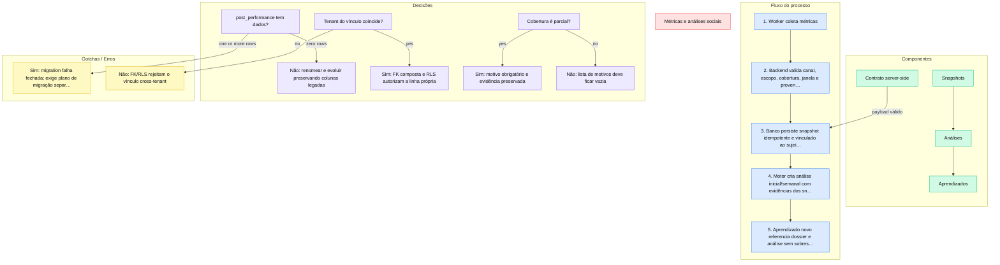

# Métricas e análises sociais

> Contrato multi-tenant e versionado para transformar métricas de Instagram, LinkedIn e canais futuros em análises e aprendizados rastreáveis, sem acoplar o domínio ao Composio.

**Status:** fundação de schema e validação concluída na DEV-1647; coleta e primeira gravação real ainda pertencem à DEV-1648. Nenhuma migration foi aplicada em produção por esta story.

## Por que foi construído assim

O banco já possuía a tabela vazia `post_performance`, com dezenas de colunas específicas por plataforma. Uma segunda tabela de performance criaria duas fontes para o mesmo conceito. A migration portanto renomeia e evolui a tabela existente, preserva as colunas legadas e falha fechada se linhas aparecerem antes do rollout.

Composio continua sendo provider e transporte, não o modelo de domínio. Snapshots registram o provider usado na coleta, mas o contrato é organizado por tenant, canal, sujeito, janela e versão. Isso permite trocar o transporte e adicionar canais sem reescrever análises ou aprendizados.

## Stack

| Camada | Tecnologia |
|---|---|
| Linguagem | SQL e TypeScript |
| Validação | Zod estrito por canal e escopo |
| Banco | Supabase PostgreSQL com RLS |
| Teste isolado | PGlite com dois tenants |
| Onde roda | Backend server-side do Cadência; writers entram nas próximas stories |
| Serviços externos | Provider registrado como proveniência, atualmente Composio |

## Como funciona



Cada snapshot representa um perfil ou post e carrega janela, cobertura, versão do schema, versão do snapshot, métricas, evidência e proveniência. Análises `initial` e `weekly` referenciam explicitamente os snapshots usados e classificam cada evidência como `supporting`, `contradicting` ou `context`. Aprendizados são novos registros versionados e apontam para a versão exata do dossier que os originou.

As FKs compostas carregam `tenant_id` e `channel`. Isso impede que uma conexão, publicação, análise ou snapshot de outro tenant seja associado por engano, inclusive em código server-side que usa `service_role`.

## Decisões técnicas

- **Evoluir em vez de duplicar:** `post_performance` é renomeada somente se continuar vazia; dados inesperados interrompem a migration.
- **Provider-neutral:** provider fica em proveniência; o vocabulário do domínio é canal, escopo, janela, cobertura e versão.
- **Evidência relacional:** a relação análise-snapshot usa tabela própria e papel explícito, evitando FK polimórfica escondida em JSONB.
- **Mesmo sujeito:** a FK do aprendizado inclui a conexão da análise, bloqueando mistura entre contas do mesmo tenant/canal.
- **Stream de aprendizado:** `learning_version` cresce por conexão e canal, atravessando análises; o writer deve alocar a próxima versão dentro da mesma transação.
- **Versão de análise:** `analysis_version` reinicia por janela; reprocessar a mesma janela incrementa a versão.
- **Mapeamento de proveniência:** provider, collector, versão, horário e evidence viram colunas; apenas metadata adicional permanece no JSONB `provenance`.
- **Dossier imutável:** aprendizados apontam para `tenant_dossier(id, version)`; não atualizam nem sobrescrevem o dossier original.
- **Escrita server-side:** usuários autenticados podem ler somente o próprio tenant; writes ficam revogados e passam pelo backend.

## Gotchas & armadilhas

- **Tabela deixou de estar vazia** — a migration aborta; audite e crie um plano de compatibilidade antes de tentar novamente.
- **Cobertura incoerente** — `partial` sem motivo e `complete` com motivos são rejeitados.
- **Indisponível não é zero** — `unavailable` exige motivo e payload vazio; os estados `complete`/`partial` exigem pelo menos uma métrica.
- **Taxas normalizadas** — engagement e retenção usam fração entre `0` e `1`; o writer converte percentuais do provider antes de validar.
- **`updated_at` legado** — snapshots são append-only por versão; a coluna preservada não pertence ao contrato novo e só pode ser removida em cleanup destrutivo separado.
- **Histórico bloqueia DELETE** — desconectar uma conta atualiza status; conexão com análises/aprendizados não é apagada, preservando a trilha auditável.
- **JSONB não é vale-tudo** — constraints cobrem estrutura mínima; Zod restringe chaves e valores por canal/escopo antes da escrita.
- **Schema não é coleta** — DEV-1647 cria a fundação; DEV-1648 ainda precisa executar a primeira coleta e persistência reais.
- **Migration pendente** — testes isolados não autorizam aplicação em produção.

## Como operar

```bash
# Rodar o contrato e a migration em banco isolado
npx vitest run src/lib/social-analytics-contract.test.ts tests/integration/social-analytics-migration.test.ts tests/integration/social-analytics-postgres.test.ts tests/api/tenant-isolation-guard.test.ts

# Validar os arquivos da story
npx eslint src/lib/social-analytics-contract.ts src/lib/social-analytics-contract.test.ts tests/integration/social-analytics-migration.test.ts tests/integration/social-analytics-postgres.test.ts tests/api/tenant-isolation-guard.test.ts
```

Antes de aplicar a migration em qualquer ambiente compartilhado, consultar a contagem real de `post_performance`. Produção exige autorização textual específica.

## FAQ

**A DEV-1647 já coleta métricas?**
Não. Ela define banco, RLS, constraints, tipos e validadores. A primeira gravação real é escopo da DEV-1648.

**Por que manter colunas antigas depois do rename?**
Removê-las seria destrutivo e desnecessário para esta story. O contrato novo usa colunas canônicas; limpeza futura exige auditoria e migration própria.

**Por que não criar uma tabela por rede social?**
Porque versão, janela, cobertura, proveniência e identidade multi-tenant são iguais. O Zod diferencia o payload por canal sem duplicar o lifecycle no banco.

**O `service_role` garante isolamento?**
Não. Ele ignora RLS; por isso writers server-side continuam obrigados a filtrar tenant e as FKs carregam `tenant_id` explicitamente.

## Referências

- DEV-1647 — modelar métricas e análises por canal
- DEV-1625 — Epic D
- [Conexões e publicação social](../social-connections/index.md)
- [ADR-0010 — Composio OAuth único](../../adr/0010-composio-oauth-unico.md)
- [ADR-0019 — Publicação social assíncrona](../../adr/0019-publicacao-social-assincrona-estado-por-canal.md)
