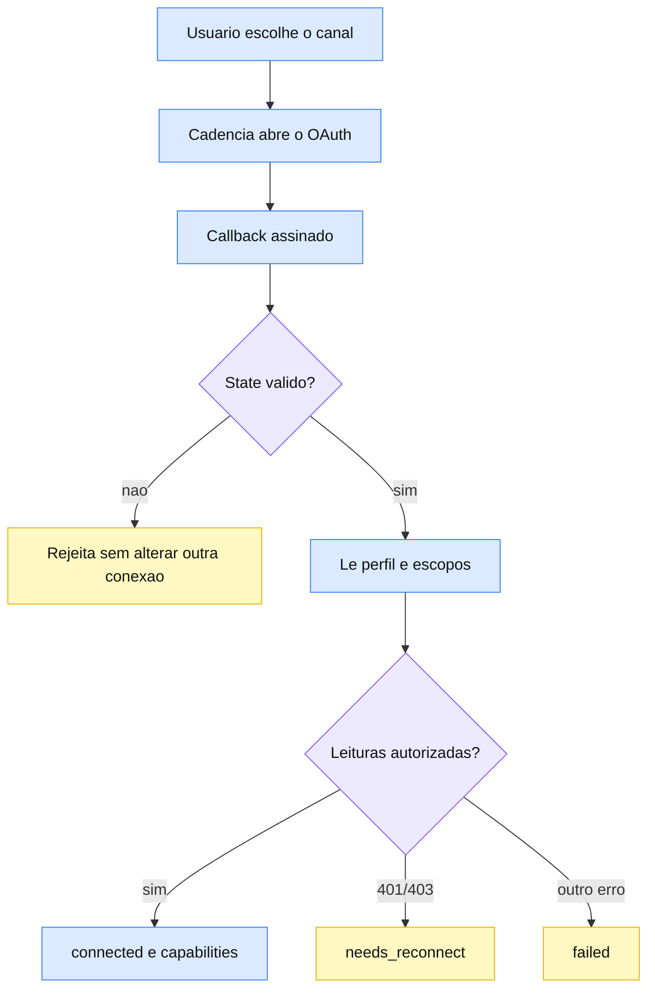

# Conexões sociais via Composio

> Conecta Instagram e LinkedIn por OAuth e comprova as permissoes da conta sem publicar conteudo de teste.

## Por que foi construído assim

Concluir o OAuth prova autorizacao, mas nao prova que a conta conectada possui identidade, tipo de conta e escopos suficientes. Publicar um post de teste criaria uma mutacao visivel na conta do cliente.

O Cadencia usa leituras do Composio para produzir evidencia de cada capability. Uma allowlist fechada impede ferramentas de criacao, upload, comentario, envio, atualizacao ou exclusao durante a validacao.

## Stack

| Camada | Tecnologia |
|---|---|
| Linguagem | TypeScript |
| Framework | Next.js App Router |
| Banco | Supabase PostgreSQL |
| Onde roda | Vercel |
| Servico externo | Composio API v3.1 |

## Como funciona



O estado assinado vincula a tentativa ao tenant, usuario, canal e `auth_config`. No callback, o backend confirma a conta conectada e executa somente leituras permitidas. Elas produzem `canReadProfile`, `canReadPosts`, `canPublish` e `canReadInsights`.

No Instagram, perfil, midia, limite de publicacao e insights sao verificacoes separadas. No LinkedIn, a leitura do proprio perfil prova identidade e uma leitura protegida pelo escopo de publicacao comprova `canPublish` sem criar conteudo. O resultado fica em `social_connections` e cada canal e atualizado independentemente.

## Decisões técnicas

- Validar antes de marcar como conectado: OAuth concluido nao basta.
- Rejeitar em runtime todo slug fora da allowlist de leituras.
- Persistir capabilities com base em chamadas aceitas, nunca por otimismo.
- Filtrar persistencia por tenant, usuario, provedor e canal.
- Transformar HTTP 401/403 em `needs_reconnect`; demais falhas em `failed`.

## Gotchas e armadilhas

- **Instagram pessoal nao basta.** A integracao requer conta Business ou Creator.
- **Perfil alimenta outras leituras.** Midia e insights usam o ID devolvido pelo perfil.
- **LinkedIn tem evidencia parcial de leitura.** Sem outro identificador, `canReadPosts` e `canReadInsights` permanecem `false`.
- **E2E exige conta real.** Testes provam o contrato, mas permissoes reais dependem de OAuth nos dois canais.
- **Segredo somente no servidor.** `COMPOSIO_API_KEY` nao pode aparecer no cliente, fixtures ou logs.

## Como operar

```powershell
npm run test -- src/lib/social-connections-server.test.ts src/app/api/social/connections/callback/route.test.ts src/app/api/social/connections/connect/route.test.ts src/lib/social-connections.test.ts
npx tsc --noEmit --incremental false
npm run build
```

Para diagnostico, consultar `social_connections` sempre com `tenant_id` e `channel` explicitos. Verificar `status`, `capabilities`, `last_error` e `last_validated_at`.

## FAQ

**A validacao publica ou apaga um post de teste?**

Nao. O executor aceita somente a allowlist de ferramentas de leitura.

**Por que o status pode virar `needs_reconnect`?**

O provedor devolveu 401 ou 403 ao ler perfil ou um escopo obrigatorio. O usuario precisa corrigir o tipo da conta ou as permissoes e reconectar.

**Uma falha no Instagram derruba o LinkedIn?**

Nao. Cada canal mantem estado proprio.

**TikTok esta disponivel?**

Nao nesta etapa da Epic A.

