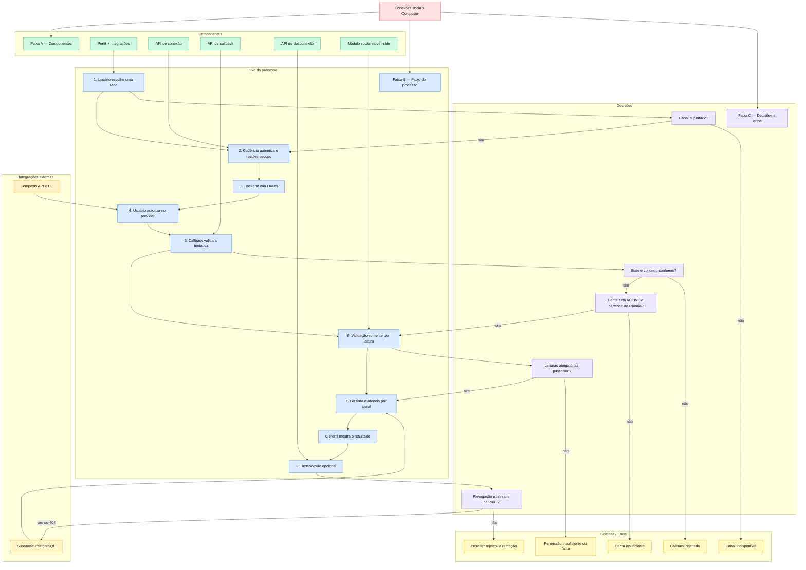

# Conexões sociais via Composio

> Conecta, valida e desconecta Instagram e LinkedIn por OAuth, com estado independente por canal e sem publicar conteúdo de teste.

## Por que foi construído assim

Concluir o OAuth prova autorização, mas não prova que a conta conectada possui identidade, tipo de conta e escopos suficientes. Publicar um post de teste criaria uma mutação visível na conta do cliente.

O Cadência usa leituras do Composio para produzir evidência de cada capability. Uma allowlist fechada impede ferramentas de criação, upload, comentário, envio, atualização ou exclusão durante a validação.

## Stack

| Camada | Tecnologia |
|---|---|
| Linguagem | TypeScript |
| Framework | Next.js App Router |
| Banco | Supabase PostgreSQL |
| Onde roda | Vercel |
| Serviço externo | Composio API v3.1 |

## Como funciona



O estado assinado vincula a tentativa ao tenant, usuário, canal, origem, timestamp, nonce e `auth_config`. Se já houver uma connected account `ACTIVE` para o mesmo usuário e canal, o backend pode reaproveitá-la sem abrir outro consentimento. No callback, ele confirma a conta conectada e executa somente leituras permitidas. Elas produzem `canReadProfile`, `canReadPosts`, `canPublish` e `canReadInsights`.

No Instagram, perfil, mídia, limite de publicação e insights são verificações separadas. No LinkedIn, a leitura do próprio perfil prova identidade e a leitura server-side do `auth_config` exige o scope `w_member_social` para comprovar `canPublish` sem criar conteúdo. O resultado fica em `social_connections` e cada canal é atualizado independentemente.

Ao desconectar, o Cadência primeiro solicita a remoção da connected account no Composio com revogação. A linha local só é encerrada depois do sucesso upstream; HTTP 404 também é aceito como sucesso idempotente. Se o provider rejeitar a operação, o estado local permanece ativo para não comunicar uma desconexão falsa.

## Decisões técnicas

- Validar antes de marcar como conectado: OAuth concluído não basta.
- Rejeitar em runtime todo slug fora da allowlist de leituras.
- Persistir capabilities com base em chamadas aceitas, nunca por otimismo.
- Filtrar persistência por tenant, usuário, provedor e canal em toda leitura e mutação administrativa.
- Transformar HTTP 401/403 em `needs_reconnect`; demais falhas em `failed`.
- Preservar uma conexão ativa anterior quando um callback novo falhar; a falha vira linha de auditoria encerrada.
- Separar callback social de Supabase Auth: o callback Composio nunca escreve cookies da sessão da aplicação.
- Revogar no Composio antes de encerrar localmente; falha upstream mantém o estado local ativo.
- Limitar todas as chamadas Composio relevantes a 8 segundos.

## Estados persistidos

| Estado | Significado | Próxima ação |
|---|---|---|
| `connected` + `active` | Perfil e permissões mínimas comprovados | Canal disponível para as próximas etapas |
| `needs_reconnect` | Credencial revogada, permissão insuficiente ou desconexão voluntária | Reconectar o mesmo canal |
| `failed` | Falha não recuperável automaticamente | Exibir motivo útil sem alterar outra rede |

O índice único parcial permite no máximo uma conexão ativa por `tenant_id + user_id + channel + provider`. Linhas com `disconnected_at` preservam histórico e auditoria.

## Gotchas e armadilhas

- **Instagram pessoal não basta.** A integração requer conta Business ou Creator.
- **Perfil alimenta outras leituras.** Mídia e insights usam o ID devolvido pelo perfil.
- **LinkedIn tem evidência parcial de leitura.** Sem outro identificador, `canReadPosts` e `canReadInsights` permanecem `false`.
- **E2E exige conta real.** Testes provam o contrato, mas permissões reais dependem de OAuth nos dois canais.
- **Segredo somente no servidor.** `COMPOSIO_API_KEY` não pode aparecer no cliente, fixtures, documentação ou logs.
- **Callback social não é callback de login.** Reutilizar helpers de Supabase Auth pode sobrescrever cookies e causar loop de autenticação.
- **404 na desconexão é idempotente.** Significa que a conta já não existe no provider e permite encerrar a linha local.

## Como operar

Execute no clone do repositório `cadencia-app`:

```powershell
npm run test -- src/lib/social-connections-server.test.ts src/lib/social-connections-client.test.ts src/lib/social-connections-feedback.test.ts src/app/api/social/connections/callback/route.test.ts src/app/api/social/connections/connect/route.test.ts src/app/api/social/connections/disconnect/route.test.ts src/components/brand/BrandProfile.social-connections.test.tsx src/lib/social-connections.test.ts
npx eslint src/lib/social-connections-server.ts src/app/api/social/connections/connect/route.ts src/app/api/social/connections/callback/route.ts src/app/api/social/connections/disconnect/route.ts
npm run build
```

Para diagnóstico, consultar `social_connections` sempre com `tenant_id`, `user_id`, `provider` e `channel` explícitos. Verificar `status`, `connection_status`, `status_reason`, `capabilities`, `provider_account_id`, `provider_account_username`, `last_error_code`, `last_error_message`, `connected_at`, `last_sync_at`, `last_status_check_at` e `disconnected_at`.

`status` representa o resultado funcional da validação (`connected`, `needs_reconnect` ou `failed`). `connection_status` representa o ciclo técnico da conexão externa (`active` ou `revoked`).

## Validação em produção

Em 02/08/2026, após o PR #283 chegar a `master`, o fluxo foi executado no Chrome em `cadencia.app.br`: Instagram e LinkedIn foram desconectados e reconectados pelo Perfil. O Supabase confirmou novas conexões `connected/active`, capabilities persistidas e ausência de erros. A API do Composio confirmou as duas novas contas como `ACTIVE` e retornou 404 para as contas anteriores revogadas.

Os smokes públicos também comprovaram: login disponível, Perfil protegido sem sessão, connect/disconnect retornando 401 sem autenticação e callback inválido redirecionando de forma controlada sem emitir `Set-Cookie`.

## FAQ

**A validação publica ou apaga um post de teste?**

Não. O executor aceita somente a allowlist de ferramentas de leitura.

**Por que o status pode virar `needs_reconnect`?**

O provedor devolveu 401 ou 403 ao ler perfil ou um escopo obrigatório. O usuário precisa corrigir o tipo da conta ou as permissões e reconectar.

**Uma falha no Instagram derruba o LinkedIn?**

Não. Cada canal mantém estado próprio.

**Por que a interface pode mostrar LinkedIn sem posts ou insights?**

O toolkit atual comprova perfil e permissão de publicação, mas não oferece essas duas leituras sem identificadores adicionais. As capabilities permanecem `false` em vez de afirmar suporte inexistente.

**O que acontece se o Composio falhar durante a desconexão?**

O Cadência retorna erro e mantém a linha local ativa. Assim a interface não declara uma desconexão que não ocorreu no provider.

**TikTok está disponível?**

Não nesta etapa. A Epic A (DEV-1622) suporta Instagram e LinkedIn; TikTok continua visível apenas como indisponível.

## Referências

- Linear: DEV-1622, DEV-1630, DEV-1631, DEV-1632, DEV-1633, DEV-1634 e DEV-1682
- Release: [cadencia-app PR #283](https://github.com/felipeluissalgueiro/cadencia-app/pull/283)
- RFC: [RFC-003 — Integração social Composio](../../../rfcs/RFC-003-integracao-social-composio.md)

