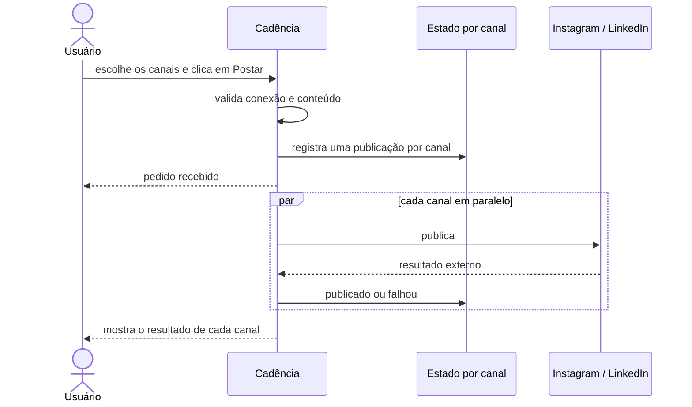

# Conexões e publicação social

O Cadência conecta Instagram e LinkedIn pelo Composio e permite distribuir o conteúdo pronto diretamente pelo app. A conexão e a publicação são etapas separadas: concluir o OAuth não cria post de teste, e aceitar um pedido de publicação ainda não significa que o provedor terminou.

**Status:** estável em produção desde 7 de agosto de 2026.

## O que o usuário pode fazer

- Conectar ou reconectar Instagram e LinkedIn em **Perfil > Integrações**.
- Publicar um carrossel no Instagram, no LinkedIn ou nos dois ao mesmo tempo.
- Publicar o texto gerado na aba LinkedIn.
- Continuar usando o app enquanto os provedores processam o pedido.
- Ver confirmação ou falha separada para cada rede.

Facebook e TikTok ainda não fazem parte desse fluxo.

## Onde o botão aparece

| Conteúdo | Opções |
|---|---|
| Carrossel | Instagram e LinkedIn, juntos ou separados |
| Post da aba LinkedIn | somente LinkedIn |

Ao aceitar o pedido, o seletor fecha e o Cadência mostra que a publicação continua em segundo plano. A confirmação “Publicado” só aparece depois que o estado real do canal foi persistido.

## Como a conexão funciona

1. O usuário escolhe a rede em **Perfil > Integrações**.
2. O Cadência abre o consentimento OAuth do provedor.
3. No retorno, valida a identidade e as permissões concedidas.
4. Somente leituras permitidas são executadas; nenhum conteúdo é publicado nessa etapa.
5. A conexão fica disponível apenas quando a capacidade de publicação foi comprovada.

Cada rede tem estado independente. Um problema no LinkedIn não desconecta o Instagram e vice-versa.

| Estado | O que significa |
|---|---|
| Conectado | identidade e permissões mínimas foram comprovadas |
| Reconexão necessária | credencial revogada ou permissão insuficiente |
| Falhou | o callback não pôde ser concluído; a outra rede é preservada |

## Como a publicação funciona

### Por que o app não espera com a tela aberta

O Instagram pode levar dezenas de segundos para preparar e publicar um carrossel. Quando a interface aguardava o processo inteiro, parecia travada e incentivava o usuário a recarregar a página, mesmo com o post em andamento.

Agora o Cadência separa duas confirmações:

1. **Pedido recebido:** a validação passou e o trabalho foi registrado.
2. **Publicado:** o provedor confirmou e o resultado foi salvo.

Essa decisão está registrada na [ADR-0019](../../adr/0019-publicacao-social-assincrona-estado-por-canal.md).

## Segurança contra duplicidade

Cada canal possui sua própria linha de estado, chave de idempotência e lease de execução.

- Recarregar a página não cria uma segunda publicação.
- Um replay enquanto o trabalho está ativo reutiliza o estado existente.
- Um canal já publicado não é enviado novamente.
- Falha confirmada pode receber retry controlado.
- Instagram e LinkedIn processam em paralelo; um canal não segura o outro.

No LinkedIn, uma resposta perdida pode deixar dúvida sobre a criação do post. Nessa situação o Cadência não repete automaticamente: primeiro é necessário reconciliar o perfil. Essa cautela evita duplicar um post que talvez já tenha sido publicado.

## Regras por canal

### Instagram

- Aceita carrossel pronto com 2 a 10 slides.
- Converte os PNGs canônicos para JPEG por uma URL temporária assinada.
- Persiste o identificador do container antes da etapa final.
- Retoma um container conhecido em vez de criar outro quando uma lease expira.

### LinkedIn

- Publica o texto gerado ou um carrossel multi-imagem.
- O texto é limitado a 3.000 caracteres.
- Os slides são preparados e enviados antes da criação do post.
- Após a confirmação, o Cadência reconcilia o registro legado para impedir que o antigo dispatcher publique o mesmo conteúdo.

## Operação

Para o LinkedIn direto funcionar sem duplicidade, o Growth deve permanecer em modo somente preparação. Ele gera o texto, mas não o despacha pelo mecanismo antigo. O app é o responsável pela publicação visível.

As credenciais e segredos vivem no 1Password e nas variáveis server-side do deployment. Nunca devem aparecer no bundle do navegador, em fixtures ou em logs de suporte.

## Diagnóstico

### O app mostrou “pedido recebido”, mas o post não apareceu

Isso ainda não é falha: o pedido pode estar em processamento. A confirmação final é mostrada separadamente. Se o limite de acompanhamento terminar, o app mantém o estado como pendente em vez de inventar uma falha.

### O Instagram informou indisponibilidade de mídia

Verifique:

1. se a execução ocorreu no deployment de produção correto;
2. se a conexão continua ativa e com permissão de publicação;
3. se o carrossel continua pronto e possui de 2 a 10 slides válidos;
4. se as URLs pertencem ao Storage permitido;
5. o estado persistido da publicação e o log da tarefa em segundo plano.

### A rede aparece como “Conexão necessária”

Abra **Perfil > Integrações**. Se a credencial foi revogada ou perdeu permissão, reconecte apenas aquela rede.

## O que não fazer

- Não publicar para testar se o OAuth funciona.
- Não tratar “pedido recebido” como prova de publicação.
- Não repetir uma criação LinkedIn quando o resultado externo estiver desconhecido.
- Não consultar dados sociais sem o tenant explícito.
- Não reativar o dispatcher LinkedIn antigo enquanto o publisher direto estiver ativo.
- Não copiar credenciais para documentação ou mensagens.

## Validação de produção

Em 7 de agosto de 2026, um mesmo carrossel foi publicado em Instagram e LinkedIn. Os canais processaram em paralelo, chegaram a `published` separadamente e foram confirmados visualmente nos dois perfis. A interface fechou após o aceite e exibiu o resultado real sem bloquear o usuário.

O release passou por cinco execuções completas da suíte, build, verificação de tipos, lint e revisão adversarial sem achados abertos.

## Referências

- [ADR-0010 — Composio OAuth único](../../adr/0010-composio-oauth-unico.md)
- [ADR-0019 — Publicação social assíncrona](../../adr/0019-publicacao-social-assincrona-estado-por-canal.md)
- Fonte técnica: `cadencia-app/docs/features/social-connections/index.md`
