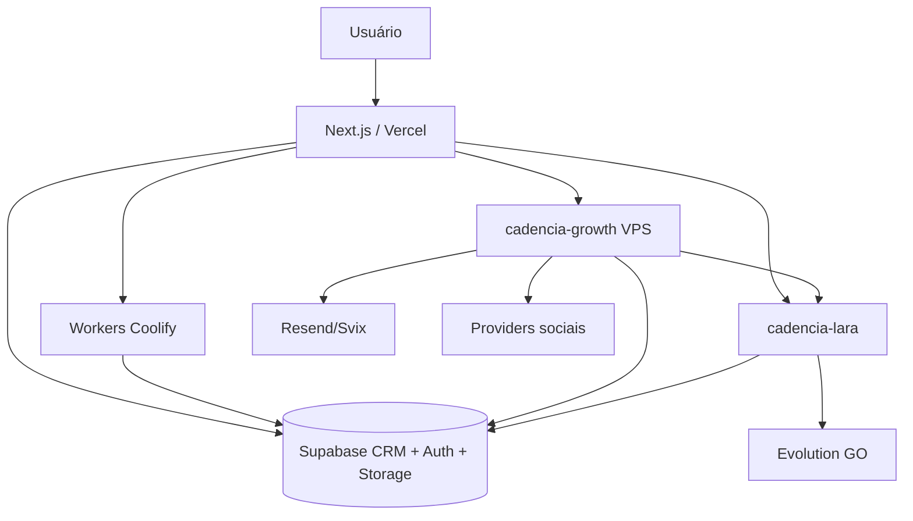

# Foundation — arquitetura técnica

## Camadas

- **Frontend/API:** Next.js 15 na Vercel.
- **Dados:** Supabase PostgreSQL, Auth, Storage e Realtime.
- **Workers:** geração pesada no Coolify VPS Master.
- **Growth:** cron, dispatch, scoring e cadências na VPS Master.
- **Lara:** WhatsApp, agente, KB, tools e agenda multi-provider.
- **Email:** Resend com domínio por tenant e webhook Svix.

## Contratos

- `tenant_id` atravessa todas as fronteiras.
- Chamadas internas usam segredo/HMAC e idempotency key.
- Eventos externos validam assinatura.
- Jobs longos ficam fora do timeout da Vercel.
- Estado compartilhado vive no banco, não na memória do processo.
