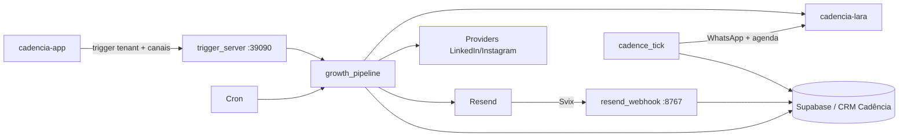
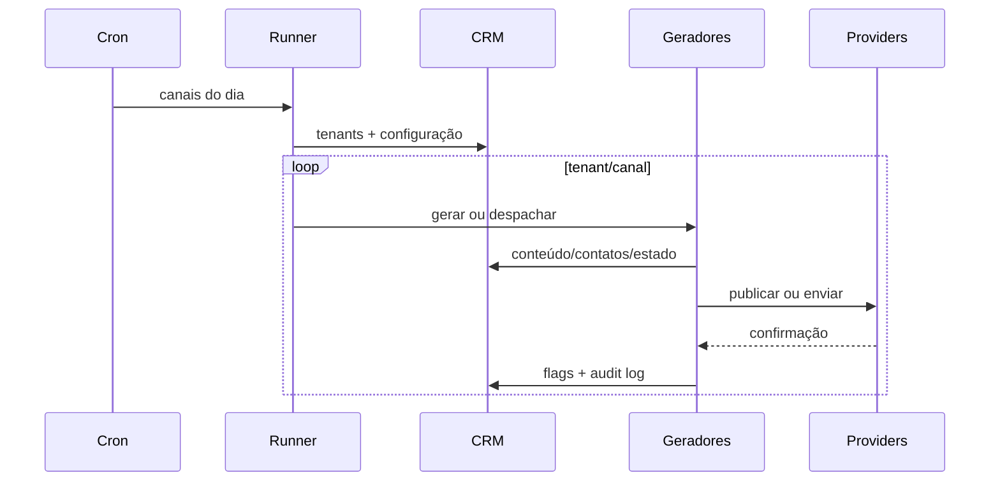

# Arquitetura — cadencia-growth

## Contexto

## Containers e processos

| Processo | Entrada | Saída |
|---|---|---|
| `trigger_server.py` | HTTP `:39090` | execução on-demand |
| `growth_pipeline.py` | cron/canais | scripts de geração e dispatch |
| `seinfeld_generate.py` | posts + contatos | email Resend + logs |
| `newsletter_generate.py` | posts da semana | digest Resend + logs |
| `resend_webhook.py` | Svix `:8767` | score/supressão/eventos |
| `cadence_tick.py` | cron + CRM | checks, envios e avanço |
| `provision_tenant.py` | tenant/config | CRM, blog, domínio Resend e DNS |
| `mission_control.py` | HTTP `:8768` | observabilidade operacional |

## Dados

- Supabase é a fonte de tenants, contatos, posts, scoring e cadências.
- `service_role` sempre exige filtro explícito de `tenant_id`.
- `config.email` é a casa canônica de sender/provider/domínio.
- `scoring_events` guarda atribuição por `post_id`.
- `cadence_step_checks` fornece idempotência por step/ciclo.

## Fluxo diário

## Decisões

- Canais falham isoladamente; um provider não bloqueia os demais.
- Email e scoring usam Resend/Svix.
- WhatsApp e disponibilidade pertencem à Lara; estado da cadência pertence ao CRM.
- Idempotência fica no banco, não só na memória do processo.
- Operações pesadas rodam na VPS, fora do timeout da Vercel.

## Portas ativas

| Porta | Serviço |
|---|---|
| `39090` | trigger on-demand |
| `8767` | webhook Resend/Svix |
| `8768` | Mission Control |
