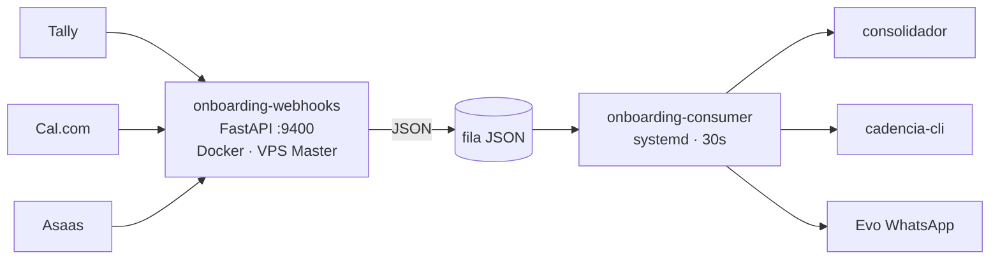

# Central de CS — Automação do Onboarding (Visão Geral)

Entry-point único do sistema entregue em **24/06/2026** (DEV-837 + cadeia). Em produção na VPS Master. `ONBOARDING_APPLY=1` ativo. Webhooks Tally/Cal.com/Asaas recebendo.

## TL;DR

Pipeline determinístico **evento → fila → ação** que automatiza o onboarding pós-fechamento de cliente.
- 3 webhooks (Tally / Cal.com / Asaas) escrevem jobs JSON num diretório (volume compartilhado).
- 1 worker systemd (`onboarding-consumer`) consome a fila na VPS Master e dispara:
	- consolidador (CRM + Asaas + tenant + Manual PDF)
	- sync Cal.com → CRM (timeline + opp move)
	- T-0 Asaas (libera implantação)
- Idempotente, gate `APPLY` separado de `dry_run`, WhatsApp via Evo corporativo.
- Receiver = container Docker isolado. Consumer = clone do pd-framework. **Sem agente tool-use na Master** — compatível com `_core/SECURITY.md`.

## Arquitetura

## Componentes

| # | Componente | Path | Nota |
|---|---|---|---|
| 1 | Receiver | `_repos/onboarding-webhooks/` | [[02-Receiver]] |
| 2 | Consumer | `times/cs/workers/onboarding-consumer/` | [[03-Consumer]] |
| 3 | Consolidador | `_shared/consolidador_onboarding.py` + `_shared/crm_onboarding.py` | [[04-Consolidador]] |
| 4 | Doc Generator | `_shared/doc_generator.py` + `times/cs/foundation/templates-documentos/` | [[05-Doc-Generator]] |
| 5 | Workers acompanhamento | `times/cs/workers/{aprovacao-tacita-debrief,chip-aquecimento-14d,...}/` | [[08-Workers-Acompanhamento]] |
| 6 | Stakeholders | `_shared/stakeholders.py` + `matriz_responsabilidades.py` | [[06-Stakeholders]] |
| 7 | Evo Client | `_shared/evo_client.py` + shim `stevo_client.py` | [[07-Evo-Client]] |
| 8 | Infra Deploy | VPS Master `/opt/...` + systemd + Traefik | [[01-Infra-Deploy]] |

## Don'ts

- Não rodar agente Claude com tool-use na VPS Master.
- Não chamar `cadencia-cli` direto do receiver (sempre enfileirar).
- Não fazer `docker build` sem `--no-cache` em deploy real do receiver.
- Não ligar `APPLY=1` sem validar dry_run primeiro.
- Não imprimir valores de credenciais em logs.

## Links

- Skill: `/ativar-cliente`
- Skill: `/pos-briefing` — dispara Bloco D.1 isolado (07/07/2026)
- Skill: `/validar-prompt` — dispara Blocos D.2/G isolado, orquestrador `pos_kickoff` (07/07/2026)
- [Linear — Automação do Onboarding CS (Fases 1-7)](https://linear.app/cadencia/project/automacao-do-onboarding-cs-fases-1-7-b37d1d5ef0d7)
- Mapa vivo: `pd-framework/times/cs/context/mapa-automacao-onboarding.md`
- Handoff: `pd-framework/times/cs/context/handoff-central-cs-2026-06-24.md`
- cadencia-docs (fonte de verdade): `docs/central-cs-onboarding/00-Visao-Geral.md`
- Detalhe: [[13-Referencia-Tecnica-Componentes-2026-07-05]] · [[14-Pos-Kickoff-Validacao-Prompt-2026-07-07]]

## Histórico

- 2026-06-24 — Sistema entregue, deploy na VPS Master, fixes F1–F8 aplicados.

---

## Atualização 2026-06-27 — Material de Aquecimento WhatsApp (Fase 4.5)

Novo template padrão entregue:

- **Template:** `times/cs/foundation/templates-documentos/material-aquecimento-chip.html`
- **Função geradora:** `_shared/doc_generator.gerar_material_aquecimento_chip(cliente, owner_pd, saida_dir)`
- **Versão amigável** do protocolo interno `times/cs/foundation/protocolo-aquecimento-chip-14d.md` (que tem jargão técnico). Cliente recebe passo a passo Dia 01 → Dia 14.

### Padrão de entrega (dois destinos simultaneamente)

1. **Grupo WhatsApp do cliente** via Evolution `send_document` (instância comercial)
2. **Pasta compartilhada cliente** em `<OneDrive>\Documentos\Empresa\Clientes\<NomeCliente>\Materiais Cadencia\` (sincroniza pra cliente acessar depois)

### Gotcha base64 (Evolution)

Pra mandar arquivo local sem URL pública:
- `data:application/pdf;base64,XXX` → rejeitado: `invalid base64 encoding`
- string base64 **raw** no campo `url` → funciona

Validado e2e 2026-06-27 com OP Odontopenha. Helper `send_local_document` virá na [[DEV-913]].

### 1ª produção

OP Odontopenha — sessão Felipe ao vivo 2026-06-27 10:53 BRT. PDF entregue no grupo `120363425789219066@g.us` + copiado pra `OneDrive\Documentos\Empresa\Clientes\OP Odontopenha\Materiais Cadencia\Aquecimento-WhatsApp-OP-Odontopenha.pdf`.

### Refs sessão

- Issue automação: [[DEV-913]]
- Log: [[Sessoes/Logs/2026-06-27 dev-cs-dev-897-deploy-workers-master]]
- Doc interno (protocolo bruto Time CS): `times/cs/foundation/protocolo-aquecimento-chip-14d.md`

---

## Atualização 2026-07-07 — Pacote pós-kickoff / Validação de Prompt (Fases 5-7)

Módulo novo `times/cs/workers/pos_kickoff/` cobre o trecho entre "Integrações & IAs" e "Estabilização pós-Go-Live": form de feedback (Tally), Manual do Sistema + Roteiro de Testes, estágios de pipeline, dispatch email+WhatsApp, ciclo de teste, checklist Go-Live, estabilização. 8 Epics (DEV-1237/1227/1232/1241/1247/1252/1258/1219), Modo A, orquestrador único sempre em preview (nenhum side-effect real sem confirmação humana).

Validado primeiro **manual** com OP Odontopenha (CSE-152..159 — email+WhatsApp reais entregues, form Tally real), depois automatizado a partir do que provou funcionar.

Comandos novos: `/pos-briefing` (D.1 isolado) e `/validar-prompt` (D.2/G isolado) — evitam ter que re-rodar `/ativar-cliente` inteiro desde o Bloco A só pra chegar nessas etapas.

Detalhe técnico completo: [[14-Pos-Kickoff-Validacao-Prompt-2026-07-07]].

### Refs sessão

- Projeto: [Automação do Onboarding CS (Fases 1-7)](https://linear.app/cadencia/project/automacao-do-onboarding-cs-fases-1-7-b37d1d5ef0d7)
- PRs: #49 (8 Epics), #52 (skills /pos-briefing e /validar-prompt)