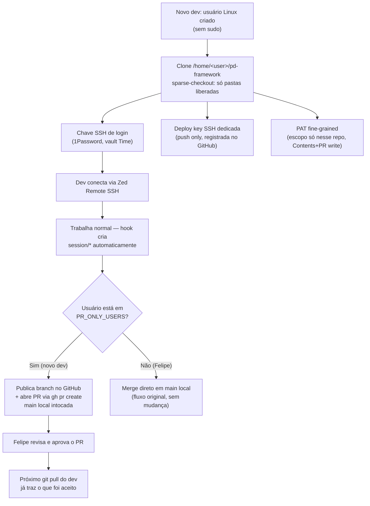

# Onboarding de dev com acesso restrito (VPS Dev)

> Como um novo dev entra na VPS Dev conectado ao `pd-framework` real — com acesso só às pastas relevantes pro trabalho dele, e sem alçada de merge direto em `main` até ganhar confiança.

## Por que foi construído assim

O primeiro dev contratado depois do Luiz (Renan Manhães, 2026-07) precisava de ambiente na VPS Dev. A abordagem anterior — usada pro próprio Luiz — foi criar um **fork separado do `pd-framework`** (`pd-framework-luiz`), uma cópia incompleta que nunca sincronizava com o framework real. Isso criava dois problemas: o dev nunca tinha o contexto completo/atualizado, e qualquer melhoria no framework real precisava ser replicada manualmente na cópia.

A alternativa óbvia — dar ao novo dev acesso total ao `pd-framework` real — esbarra em uma limitação técnica do GitHub: **não existe controle de leitura por pasta em nenhum mecanismo** (deploy key, PAT fine-grained, collaborator — todos liberam o repo inteiro pra quem tem a credencial). Avaliamos e descartamos um servidor git próprio (Gitea/Forgejo, ou espelho local `file://`) que resolveria isso de forma real — mais infraestrutura do que o ganho justificava nesse estágio.

**Solução adotada:** um clone de verdade do `pd-framework` (mesmo remoto GitHub, sem fork), com `git sparse-checkout` limitando o que aparece no disco às pastas relevantes, e um usuário Linux dedicado sem `sudo`. O boundary é por convenção + configuração, não uma garantia criptográfica — adequado ao perfil de risco de um contratado de confiança direta (indicação, supervisão de perto), não uma defesa contra ameaça interna deliberada.

## Stack

| Camada | Tecnologia |
|---|---|
| Host | VPS Dev (Hostinger, `2.24.117.172`) |
| Isolamento de usuário | Usuário Linux dedicado, sem grupo `sudo` |
| Filtro de pastas | `git sparse-checkout` (cone mode) + partial clone (`--filter=blob:none`) |
| Acesso remoto | SSH (Zed Remote SSH), chave dedicada por pessoa |
| Push pro GitHub | Deploy key dedicada por pessoa (`Contents: write` via SSH) |
| Abertura de PR | GitHub fine-grained PAT (escopo só no repo, `Contents`+`Pull requests: write`) |
| Credenciais operacionais | 1Password service account por pessoa, `.profile`, escopado a 1 vault |
| Gate de merge | Hook `stop-session-branch.py` — usuário sem alçada nunca mergeia `main` sozinho |

## Como funciona



O usuário PreToolUse/Stop já existentes no framework (`pretooluse-session-branch.py` + `stop-session-branch.py`) funcionam sem alteração pra qualquer clone — a única mudança foi um branch de comportamento no `stop-session-branch.py`: se `getpass.getuser()` está no conjunto `PR_ONLY_USERS`, a função `handle_pr_only_close()` roda no lugar do merge automático — publica a branch e chama `gh pr create`, sem tocar a `main` local.

## Decisões técnicas

- **Sparse-checkout + usuário sem sudo, em vez de repo espelho separado.** Um repo/servidor git separado (mesmo auto-sincronizado) foi avaliado e descartado por violar o princípio DRY do framework (`_core/CODING-PRINCIPLES.md` §1 — duas representações do mesmo conhecimento divergem). A solução adotada é um único repo, um clone a mais — mesmo padrão já usado entre Windows/VPS Master/VPS Dev do próprio Felipe.
- **PR-only sem exceção trivial**, diferente do motor autônomo (`_core/PR-ESCALATION-MATRIX.md`), que tem uma classe de auto-merge pra mudanças triviais. O novo dev fica abaixo do tier "Coordenador" da matriz até ganhar histórico — toda mudança dele no `pd-framework` passa por aprovação humana.
- **1Password: service account por pessoa, não por conta compartilhada genérica.** Mesmo padrão já usado com o Luiz (`.profile` com `OP_SERVICE_ACCOUNT_TOKEN` escopado a 1 vault) — permite revogação isolada por pessoa sem afetar os demais.
- **Repo `pd-framework` continua no GitHub pessoal do Felipe, não migra pra org.** Migrar pra org exporia o repo à política de permissão padrão da org (outros membros podem ter acesso a todos os repos, dependendo da config) — risco maior que o problema que resolveria.

## Gotchas & armadilhas

- **`sparse-checkout` não é uma garantia de segurança.** Um usuário com credencial de leitura no GitHub (deploy key, PAT ou collaborator) tecnicamente consegue alcançar qualquer pasta do repo se forçar (`git sparse-checkout add`, ou clonar de novo sem sparse). O filtro evita exposição acidental, não é blindagem contra tentativa deliberada.
- **Nunca imprimir valor de credencial em comando de shell/log.** `grep`/`cat` num arquivo que contém token/chave ecoam o valor no output — já aconteceu 2x nesta implementação (uma chave SSH nova, um token de service account já em uso). Regra: sempre verificar existência/conteúdo sem exibir valor (`grep -c`, ou pipe direto arquivo→arquivo sem passar por stdout visível).
- **Deploy key ≠ chave de login.** São dois pares de chave SSH completamente diferentes — uma autentica a VPS *pro GitHub* (push/pull), a outra autentica a pessoa *pra VPS* (login remoto). Nomear os itens 1Password de forma inequívoca desde o início evita confusão (`GitHub Deploy Key - ...` vs `Hostinger VPS Dev - ... (SSH Key)`).
- **`gh pr create` exige token de API, SSH não basta.** SSH (deploy key) só cobre o protocolo git (push/pull); abrir PR é uma chamada da API REST/GraphQL do GitHub, precisa de PAT ou OAuth próprio.
- **Service account do 1Password não cria outro service account.** `op service-account create` só funciona autenticado como membro humano — um agente/processo rodando como service account não consegue provisionar credencial pra outra pessoa sozinho.

## Como operar

```bash
# Ver quais pastas um clone restrito enxerga
git -C /home/<user>/pd-framework sparse-checkout list

# Adicionar/remover usuário do fluxo PR-only
# editar _core/hooks/stop-session-branch.py → PR_ONLY_USERS = {"renan", ...}

# Verificar credencial GitHub configurada pro usuário
sudo -u <user> -H gh auth status

# Verificar acesso ao vault 1Password do usuário
sudo -u <user> -H bash -c 'source ~/.profile && op vault list'
```

## FAQ

**Por que não criar um GitHub collaborator pro novo dev, é mais "correto"?**
Testado e descartado — collaborator dá leitura do repo inteiro, exatamente a mesma exposição que deploy key ou PAT. Não existe forma de dar collaborator restrito a pastas específicas.

**Por que não usar 1Password Connect em vez de service account?**
Connect resolve rate limit em cenários de alto volume (múltiplos serviços de produção batendo no 1Password). Pro volume atual (poucas pessoas, uso manual/interativo), é infraestrutura extra sem ganho — service account por pessoa já entrega revogação isolada.

**O que acontece se o dev tentar acessar uma pasta fora do sparse-checkout?**
Não existe localmente — o clone nunca baixou o conteúdo (partial clone `--filter=blob:none`). Ele precisaria rodar `git sparse-checkout add <pasta>` deliberadamente, o que buscaria do GitHub (funciona se a credencial dele tiver acesso de leitura ao repo, que tem).

**Como o dev recebe credenciais operacionais (Supabase, Vercel etc.) no dia a dia?**
Via o vault 1Password compartilhado (`service account` no `.profile` dele, escopado só a esse vault) — `op item get "<item>" --vault "<vault>"`. Nunca por mensagem/chat.
