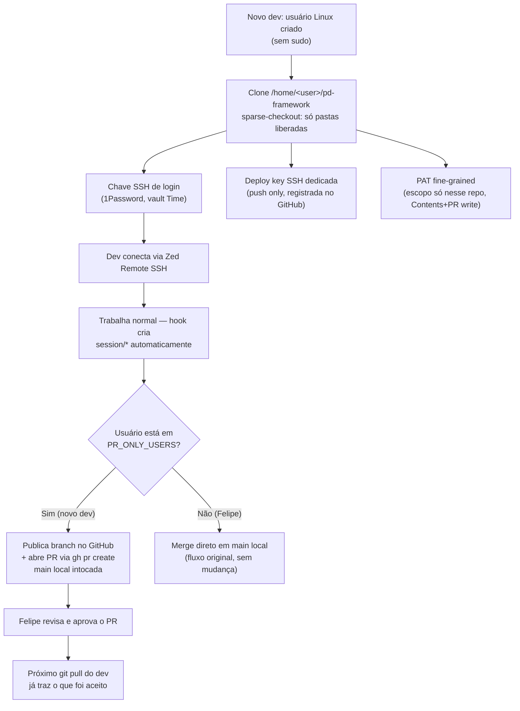

# Onboarding de dev com acesso restrito (VPS Dev)

> Como um novo dev entra na VPS Dev conectado ao `pd-framework` real — com acesso só às pastas relevantes pro trabalho dele, e sem alçada de merge direto em `main` até ganhar confiança.

## Por que foi construído assim

GitHub não tem controle de leitura por pasta em nenhum mecanismo — deploy key, PAT fine-grained e collaborator liberam sempre o repo inteiro pra quem tem a credencial. Um servidor git próprio (Gitea/Forgejo ou espelho local) resolveria isso de forma real, mas é infraestrutura desproporcional ao ganho neste estágio.

A solução adotada aceita esse limite conscientemente: o boundary de acesso é por **configuração** (sparse-checkout + usuário de sistema sem privilégio), não uma garantia criptográfica. É adequado a um perfil de confiança direta (contratação por indicação, supervisão de perto) — não é defesa contra ameaça interna deliberada.

Um repo espelho separado (mesmo auto-sincronizado) foi descartado por violar DRY (`_core/CODING-PRINCIPLES.md` §1): duas representações do mesmo conhecimento divergem. A solução usa um único repo — um clone a mais, mesmo padrão já usado entre Windows/VPS Master/VPS Dev do Felipe.

## Stack

| Camada | Tecnologia |
|---|---|
| Host | VPS Dev (Hostinger) |
| Isolamento de usuário | Usuário Linux dedicado, sem grupo `sudo` |
| Filtro de pastas | `git sparse-checkout` (cone mode) + partial clone (`--filter=blob:none`) |
| Acesso remoto | SSH (Zed Remote SSH), chave dedicada por pessoa |
| Push pro GitHub | Deploy key dedicada por pessoa (`Contents: write` via SSH) |
| Abertura de PR | GitHub fine-grained PAT (escopo só no repo, `Contents`+`Pull requests: write`) |
| Credenciais operacionais | 1Password service account por pessoa, `.profile`, escopado a 1 vault |
| Gate de merge | Hook `stop-session-branch.py` — usuário sem alçada nunca mergeia `main` sozinho |

## Como funciona



Os hooks `pretooluse-session-branch.py` + `stop-session-branch.py` funcionam sem alteração pra qualquer clone. A única mudança é um branch de comportamento em `stop-session-branch.py`: se `getpass.getuser()` está em `PR_ONLY_USERS`, `handle_pr_only_close()` roda no lugar do merge automático — publica a branch e chama `gh pr create`, sem tocar a `main` local.

## Decisões técnicas

- **Sparse-checkout + usuário sem sudo, não repo espelho separado.** Um repo/servidor git à parte violaria DRY (`_core/CODING-PRINCIPLES.md` §1). A solução é um único repo com um clone a mais.
- **PR-only sem exceção trivial.** Diferente do motor autônomo (`_core/PR-ESCALATION-MATRIX.md`), que tem classe de auto-merge pra mudanças triviais — o novo dev fica abaixo do tier "Coordenador" até ganhar histórico, toda mudança dele passa por aprovação humana.
- **1Password: service account por pessoa, não conta compartilhada genérica.** `.profile` com `OP_SERVICE_ACCOUNT_TOKEN` escopado a 1 vault, por pessoa — permite revogação isolada.
- **Repo `pd-framework` continua no GitHub pessoal, não migra pra org.** Migrar pra org exporia o repo à política de permissão padrão da org (outros membros podem ter acesso a todos os repos) — risco maior que o problema que resolveria.

## Gotchas & armadilhas

- **`sparse-checkout` não é garantia de segurança.** Credencial de leitura no GitHub (deploy key, PAT ou collaborator) alcança qualquer pasta do repo se o usuário forçar (`git sparse-checkout add`, ou clone novo sem sparse). O filtro evita exposição acidental, não bloqueia tentativa deliberada.
- **Nunca imprimir valor de credencial em comando de shell/log.** `grep`/`cat` num arquivo com token/chave ecoa o valor no output. Verificar existência/conteúdo sem exibir valor (`grep -c`, ou pipe arquivo→arquivo sem passar por stdout visível).
- **Deploy key ≠ chave de login.** Dois pares SSH diferentes — um autentica a VPS pro GitHub (push/pull), o outro autentica a pessoa pra VPS (login remoto). Nomear os itens 1Password de forma inequívoca evita confusão.
- **`gh pr create` exige token de API — SSH não basta.** SSH (deploy key) só cobre o protocolo git; abrir PR é chamada da API REST/GraphQL do GitHub.
- **Service account do 1Password não cria outro service account.** `op service-account create` só funciona autenticado como membro humano.

## Como operar

```bash
# Ver quais pastas um clone restrito enxerga
git -C /home/<user>/pd-framework sparse-checkout list

# Adicionar/remover usuário do fluxo PR-only
# editar _core/hooks/stop-session-branch.py → PR_ONLY_USERS = {"renan", ...}

# Verificar credencial GitHub configurada pro usuário
sudo -u <user> -H gh auth status

# Verificar acesso ao vault 1Password do usuário
sudo -u <user> -H bash -c 'source ~/.profile && op vault list'
```

## FAQ

**Por que não criar um GitHub collaborator pro novo dev?**
Collaborator dá leitura do repo inteiro — mesma exposição que deploy key ou PAT. Não existe collaborator restrito a pastas específicas.

**Por que não usar 1Password Connect em vez de service account?**
Connect resolve rate limit em alto volume (múltiplos serviços de produção). No volume atual (poucas pessoas, uso interativo), é infraestrutura extra sem ganho.

**O que acontece se o dev tentar acessar uma pasta fora do sparse-checkout?**
Não existe localmente — o clone nunca baixou o conteúdo (partial clone `--filter=blob:none`). Precisaria rodar `git sparse-checkout add <pasta>` deliberadamente, que busca do GitHub (funciona se a credencial tiver acesso de leitura ao repo).

**Como o dev recebe credenciais operacionais (Supabase, Vercel etc.) no dia a dia?**
Vault 1Password compartilhado (service account no `.profile`, escopado só a esse vault) — `op item get "<item>" --vault "<vault>"`. Nunca por mensagem/chat.
