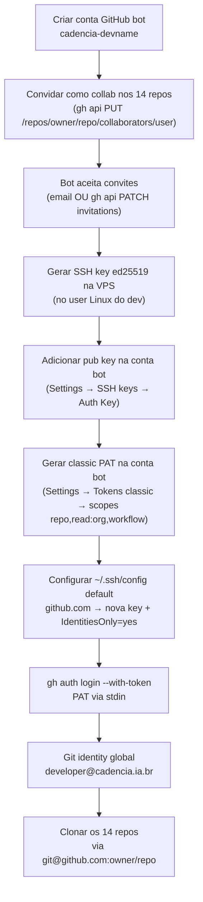

# Onboarding de dev com conta bot dedicada (cross-repo)

> Como um dev entra pra tocar **produtos Cadencia** (14 repos: `cadencia-app`, `cadencia-growth`, `cadencia-cli`, `cadencia-docs`, `cadencia-lara`, `cadencia-healthcheck`, `lara-ai`, `pd-portal`, `health-check`, `onboarding-webhooks`, `cs-workers`, `supabase-advisors`, `grafana-webhook`, `renan-onboarding`) usando uma **conta GitHub bot dedicada** (`cadencia-*`), separada da conta pessoal dele — sem depender de aprovações caso-a-caso e mantendo git blame com identidade profissional.

Complementa `onboarding-dev-acesso-restrito.md` — aquele cobre o pd-framework single-repo com deploy key + fine-grained PAT. Este cobre o padrão cross-repo pra produtos, com conta bot + classic PAT.

## Por que foi construído assim

Um dev tocando **múltiplos repos** (14, no caso do Renan) precisa de credencial que atravesse:
- Repo pessoal do Felipe (`felipeluissalgueiro/cadencia-app`)
- Repos da org `Posicionamento-Digital` (13 restantes)

**Fine-grained PAT não resolve.** Fine-grained só cobre repos da conta que criou o PAT — repos onde ela é collaborator de outra conta/org retornam 404 mesmo com o PAT autenticando. Não é permissão negada, é limitação da própria feature. Aprovação por owner externo tampouco existe: o request de PAT fine-grained só é gerado pra repos da própria conta.

**Solução:** conta GitHub bot (`cadencia-<devname>`) que é **collaborator dos repos-alvo**. Credenciais (SSH key + classic PAT) pertencem à conta bot, não ao dev pessoa. Vantagens:
- **Escopo natural** = os repos onde a conta bot é collab. Não é preciso gerenciar allowlist por repo.
- **Rotação centralizada** = trocar chaves/PAT da conta bot não afeta a conta pessoal do dev nem outros funcionários.
- **Blame consistente** = commits com email `developer@cadencia.ia.br` (identidade profissional PD), não com email pessoal do dev.
- **Off-boarding limpo** = ao desligar o dev, remove a conta bot dos repos + rotaciona credencial. Zero risco de vazamento residual pela conta pessoal.

**Trade-off aceito:** classic PAT tem scope `repo` inteiro (não escopo cirúrgico como fine-grained). Como a conta bot **só** é collab dos 14 repos, o escopo natural coincide com o desejado. Se a conta bot for adicionada como collab em outro repo no futuro, o PAT herda esse acesso automaticamente — cuidado na governança de collab.

## Stack

| Camada | Tecnologia |
|---|---|
| Host | VPS Dev (Hostinger) |
| Isolamento de usuário | Usuário Linux dedicado, sem grupo `sudo` (mesmo padrão do onboarding-dev-acesso-restrito) |
| Identidade GitHub | Conta bot separada (`cadencia-<devname>`, ex: `cadencia-renanmanhaes`) |
| Autenticação git | SSH key da conta bot (Authentication Key, `ed25519`) |
| Autenticação `gh` CLI / API | Personal access token (classic), scopes `repo`+`read:org`+`workflow` |
| Filtro de acesso | Membership de collaborator nos 14 repos (não sparse-checkout — todos os clones são full) |
| Gate de merge | Convenção PR-only. Sem branch protection server-side (evitaria bloqueio do próprio Felipe) — enforcement via code review manual + hook `stop-session-branch.py` no `pd-framework` |

## Como funciona



Estrutura final no user Linux do dev:
```
/home/<user>/
├── .ssh/
│   ├── cadencia-<devname>          ← SSH key da conta bot (privada)
│   ├── cadencia-<devname>.pub
│   ├── pd-framework-deploy         ← deploy key single-repo (se aplicável)
│   └── config                       ← default github.com → cadencia-<devname>
├── .config/gh/hosts.yml            ← gh auth com cadencia-<devname> active
├── .gitconfig                       ← user.email = developer@cadencia.ia.br (global)
├── cadencia-app/
├── cadencia-growth/
├── ... (14 repos clonados)
└── pd-framework/                   ← sparse-checkout separado, deploy key própria
```

## Decisões técnicas

- **Classic PAT em vez de fine-grained.** Fine-grained não suporta collab em outra conta/org (limitação técnica documentada). Classic com scope `repo` = "todos os repos que a conta autenticada acessa" = os 14 collab naturalmente. Sem aprovação externa necessária.
- **1 SSH key da conta bot, não 14 deploy keys.** Deploy key é per-repo. Como a conta bot precisa acessar 14 repos, uma SSH key da conta cobre todos — igual ao modelo natural do GitHub (Auth Key da conta = acesso a todos os repos que a conta pode ver).
- **Git identity separada por escopo.** Global = `developer@cadencia.ia.br` (produtos, conta bot). Local override em `pd-framework/` = `renan@cadencia.ia.br` (pessoa, deploy key). Rastreabilidade: quem toca produto age como conta profissional; quem toca framework age como pessoa (relevante pra revisão/blame).
- **`IdentitiesOnly=yes` no `~/.ssh/config`.** Impede que o SSH tente todas as chaves do `~/.ssh/` em ordem — só a chave explicitada é oferecida. Bloqueia fallback silencioso pra outra key que o dev pudesse adicionar.
- **Sem branch protection nos 14 repos.** Bloquearia push direto do Felipe em `main` também — trade-off inaceitável no volume atual. Renan opera PR-only por **convenção + code review manual**. Alternativa futura: habilitar branch protection com `bypass` pra `felipeluissalgueiro`.

## Gotchas & armadilhas

- **Convite de collab pendente retorna 404 em `git fetch`/`git ls-remote`.** Sintoma: "Repository not found" imediatamente após `gh api PUT ... /collaborators/<bot>`. Não é erro — o bot precisa aceitar. Verificar com `gh api /repos/<owner>/<repo>/invitations`; aceitar via UI/email ou `gh api -X PATCH /user/repository_invitations/<id>` (esta última exige estar autenticado como o bot).
- **`gh api /user/repository_invitations` só funciona autenticado como o próprio bot** — do login do Felipe não enxerga os invites pendentes do bot. Ordem canônica: cria conta bot → convida → autentica gh como bot → aceita todos via API.
- **`Posicionamento-Digital/cadencia-app` é redirect.** O repo mora em `felipeluissalgueiro/cadencia-app`; qualquer chamada apontando pra org resolve pro nome canônico. Não é problema — só ciente ao logar `git remote -v`.
- **Fine-grained PAT autentica mas retorna 404 em todos os repos.** Se ao rodar `gh api /repos/<owner>/<repo>` a resposta for 404 mas `gh api /user` retorna o login correto, o PAT é fine-grained e não tem escopo válido pra nenhum repo. Não é bug: trocar por classic PAT.
- **Classic PAT (`ghp_*`) é 40 chars, fine-grained (`github_pat_*`) é ~93 chars.** Verificar prefix antes de tentar debug — a página do GitHub tem 2 abas separadas ("Fine-grained tokens" vs "Tokens (classic)") no menu esquerdo.
- **Chave privada nunca sai da VPS por texto colado.** Se precisar backup no 1Password, transferir via `sudo cat` → `op item create --category="SSH Key" "private_key[concealed]=$PRIV"` no mesmo comando (env var, não arquivo intermediário). Nunca imprimir a chave no output.
- **PAT vazado no chat/log = revogação imediata.** GitHub → Settings → Tokens classic → Delete. Gerar novo, re-rodar `gh auth login`. Não "usar por enquanto e revogar depois" — o histórico do chat pode ser sincronizado em outros dispositivos/backups.
- **`gh auth login --with-token` só aceita token no stdin, nunca argumento.** `echo $TOKEN | gh auth login --with-token` é o padrão. Argumento posicional é ignorado ou vira erro dependendo da versão.
- **Ao trocar de PAT ativo, `gh auth logout --user <bot>` antes de re-logar** — senão o gh pode reusar o token antigo em cache.
- **`~/.config/gh/hosts.yml` tem tokens em texto claro** (base64-like mas trivialmente decodificável). Nunca `sudo cat` esse arquivo em contexto compartilhado — use `sudo grep -v oauth_token` se precisar inspecionar estrutura.
- **Conta pessoal do dev nunca fica logada no `gh` da VPS.** Após configurar a conta bot, rodar `gh auth logout --user <conta-pessoal>` sempre — se sobrar a conta pessoal ativa (mesmo não-default), qualquer `gh` command sem `--user` pode cair nela.

## Como operar

### Onboarding de dev novo

Executar do ambiente do Felipe (sessão com PAT admin nos 14 repos + acesso SSH ao VPS Dev):

```bash
# 1. Criar user Linux no VPS Dev (mesmo padrão do onboarding-dev-acesso-restrito)
#    Ver: onboarding-dev-acesso-restrito.md

# 2. Criar conta GitHub bot (via UI, logado como cadencia-<devname>)
#    email: developer@cadencia.ia.br (ou alias)
#    Habilitar 2FA

# 3. Convidar bot nos 14 repos (permission=push)
USER="cadencia-<devname>"
REPOS=(...)  # lista dos 14
for R in "${REPOS[@]}"; do
  gh api -X PUT "repos/$R/collaborators/$USER" -f permission=push
done

# 4. Gerar SSH key ed25519 no user Linux
ssh <VPS> "sudo -u <devuser> ssh-keygen -t ed25519 \
  -f /home/<devuser>/.ssh/cadencia-<devname> -N '' \
  -C 'cadencia-<devname>@vps-dev'"

# 5. Adicionar pub key na conta bot (UI: Settings → SSH keys → Auth Key)
#    Title: vps-dev-<devname>

# 6. Configurar ~/.ssh/config no user Linux (default → nova key + IdentitiesOnly=yes)
#    Ver template abaixo

# 7. Gerar classic PAT na conta bot (Settings → Tokens (classic))
#    scopes: repo, read:org, workflow · expiration: 90 days

# 8. Autenticar gh como bot
echo "<PAT>" | ssh <VPS> "sudo -u <devuser> gh auth login \
  --hostname github.com --git-protocol ssh --with-token"

# 9. Git identity global (produto = conta bot)
ssh <VPS> "sudo -u <devuser> bash -c '
  git config --global user.name \"<Nome Sobrenome>\"
  git config --global user.email developer@cadencia.ia.br
'"

# 10. Clonar os 14 repos (bot já autenticado via SSH)
ssh <VPS> "sudo -u <devuser> bash -c '
  cd /home/<devuser>
  for R in ...; do
    git clone --depth 20 git@github.com:\$R.git
  done
'"

# 11. Aceitar invites pendentes que sobrarem (se algum repo demorar a propagar)
ssh <VPS> "sudo -u <devuser> gh api /user/repository_invitations --jq .[].id | \
  xargs -I{} sudo -u <devuser> gh api -X PATCH /user/repository_invitations/{}"
```

### Template `~/<devuser>/.ssh/config`

```
# SSH config - user <devuser> (VPS Dev)
# Default GitHub -> conta bot cadencia-<devname>.
# IdentitiesOnly=yes impede fallback pra outras keys do ~/.ssh/.

Host github.com
    HostName github.com
    User git
    IdentityFile /home/<devuser>/.ssh/cadencia-<devname>
    IdentitiesOnly yes
```

Se o dev também opera pd-framework single-repo (via deploy key), o `core.sshCommand` local do clone `pd-framework` sobrescreve — não conflita com o default.

### Off-boarding

```bash
USER="cadencia-<devname>"
REPOS=(...)  # os 14
# Remover collab de todos os repos
for R in "${REPOS[@]}"; do
  gh api -X DELETE "repos/$R/collaborators/$USER"
done
# Revogar PAT (UI da conta bot ou API)
# Rotacionar SSH key (deletar da conta bot + remover da VPS)
# Deletar user Linux ou desativar (usermod -L)
```

### Rotação de PAT (a cada 90 dias)

Como classic PAT expira, é 1 comando + re-login:
```bash
# Gerar novo PAT na UI (mesmos scopes)
echo "<novo-PAT>" | ssh <VPS> "sudo -u <devuser> gh auth login \
  --hostname github.com --git-protocol ssh --with-token"
# Confirmar acesso preservado
ssh <VPS> "sudo -u <devuser> gh api /repos/felipeluissalgueiro/cadencia-app --jq .full_name"
```

### Validar escopo do PAT

```bash
# In-scope (14 collab) devem retornar full_name
# Out-of-scope (org sem collab) devem retornar 404
for R in felipeluissalgueiro/cadencia-app \
         Posicionamento-Digital/cadencia-growth \
         Posicionamento-Digital/insight-artificial; do
  R2=$(gh api "repos/$R" --jq .full_name 2>&1 | head -c60)
  echo "$R -> $R2"
done
```

Esperado: os 2 primeiros retornam o nome; `insight-artificial` retorna 404.

## FAQ

**Por que não expandir a collab da conta pessoal do dev em vez de criar conta bot?**
Bloqueio pragmático: o dev pode ter outras credenciais/orgs configuradas na conta pessoal. Off-boarding fica ambíguo (não dá pra revogar sem cascatear em outras coisas). Conta bot isola o escopo profissional.

**Por que classic PAT em vez de aprovar fine-grained?**
Fine-grained PAT criado pela conta bot **não gera** request de aprovação pra repos de outra conta/org — a limitação é técnica, não de permissão. Não existe fluxo "aprovar" pra usar. Classic PAT resolve em 30 segundos sem aprovação externa.

**A conta bot precisa de 2FA?**
Sim. Configurar antes de gerar PAT. GitHub exige 2FA pra membros de org em muitos casos.

**Como o dev cria PR se ele nunca faz merge direto?**
`gh pr create` da própria máquina/VPS. O PAT tem scope `repo` (inclui `Pull requests: write`). Felipe aprova + mergeia pelo browser ou por skill `/aprovar-pr`.

**Podem existir múltiplas contas bot na mesma máquina (ex: se um dev vira tech lead)?**
Sim. `gh auth login` suporta N contas; `gh auth switch --user <bot>` alterna. Cada uma tem SSH key própria + PAT próprio. Convenção: 1 conta bot por dev, escala 1:1.

**Como fica um dev que precisa acessar repos que estão fora da org `Posicionamento-Digital`?**
Adicionar como collab no repo alvo (mesma conta bot). Não há limite server-side de contas ativas na conta bot pra collab externo — só governança.
